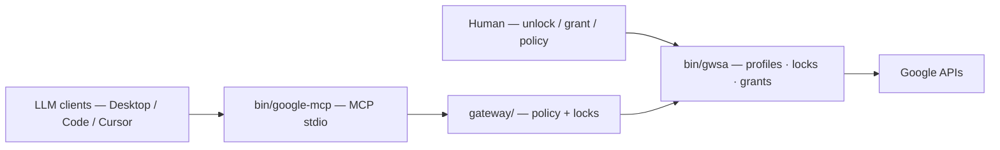

# google-multi-account

**Multi-account Google Workspace for LLM agents — 100 % local.**
Connect Claude Desktop, Claude Code or Cursor to *several* Google accounts through a local [MCP](https://modelcontextprotocol.io) server. The agent can *ask* for access; only you grant it.

[](https://github.com/elzinko/google-mcp-multi-account/actions/workflows/ci.yml)
[](https://github.com/elzinko/google-mcp-multi-account/releases)
[](LICENSE)

> **Names** — product / MCP server: `google-multi-account` · git repo: `google-mcp-multi-account` · CLI: `gwsa` · MCP binary: `google-mcp`.
> **Platform** — macOS (Apple Silicon) today (Keychain, Touch ID, Homebrew). Cross-platform is on the [roadmap](features/0017-generaliser-autres-utilisateurs.md).

**Product page:** [site/index.html](site/index.html) (landing) · [site/docs.html](site/docs.html) (docs hub).

---

## ✨ What you get

- **Multi-account, not one token** — each account is a *profile* with its own policy, locks and Drive zones. The agent targets an alias, never “your Google” as a whole.
- **The human holds every door** — unlock, Drive grant, new account, IAM fix: the agent *proposes the exact command* (elicitation), you run it.
- **Default-deny by design** — any undeclared service is refused; Gmail tools stop at the draft (no sending); Drive writes stay inside granted folders.
- **100 % local** — encrypted tokens (AES-256-GCM, master key in the macOS Keychain), per-client audit log. The only cloud step is a one-shot OAuth credential.
- **Scope today** — **Gmail + Drive** through MCP; **Calendar next**. (Docs, Sheets and Tasks are reachable through the `gwsa` CLI.)

## 🚀 Quickstart

macOS Apple Silicon. Three steps — full detail in [docs/setup-oauth.md](docs/setup-oauth.md) and [docs/mcp-setup.md](docs/mcp-setup.md).

```bash
# 1 · Provision the Google Cloud project (once, ~10 min)
git clone https://github.com/elzinko/google-mcp-multi-account.git
cd google-mcp-multi-account
brew install googleworkspace-cli                    # the gws CLI
ln -sf "$PWD/bin/gwsa" "$(brew --prefix)/bin/gwsa"  # wrapper on PATH (bootstrap)
./scripts/provision-gcp.sh                          # creates the project, guides the 2 manual steps

# 2 · Install the server and wire your Claude clients (once)
./scripts/update.sh                                 # installs outside the clone, wires Desktop + Code
```

**3 ·** Restart Claude Desktop (Cmd-Q) and ask the LLM: *“give me a rundown of my Google setup”*. It reads the setup state and proposes the exact command for each missing step — you run them. Each connected account becomes a profile:

```bash
gwsa add personal     # "personal" = your alias · browser → pick account → accept
gwsa list             # profiles + state
```

## 🧭 How it works

The LLM **can never widen its own access**. Every door opens by a human gesture the agent can *request* but not perform.



Why a wrapper, the local broker, who talks to whom: [docs/architecture.md](docs/architecture.md). Step-by-step walkthroughs: [diagrams/](diagrams/).

## 🔒 Security

Stance: **don’t trust the LLM by default** — it can *ask*, only a human opens. Per-profile locks (optional Touch ID), zoned Drive writes, no mail sending, encrypted tokens. Guarantees phase by phase, what is *not* yet covered, and how to report a flaw: [SECURITY.md](SECURITY.md) · [docs/threat-model.md](docs/threat-model.md). Honest self-critique (strengths, limits, competition): [docs/critique.md](docs/critique.md).

## 🛠 Development

```bash
./scripts/test.sh     # hermetic suite (policy, wrapper, gateway, broker) — no real account, no network
```

- **Commands** — `gwsa help` is the index of everything. LLM-guided manual tests: [tests/manuels/](tests/manuels/).
- **Releases** — the git **tag** is the source of truth; `gwsa release` derives semver from [conventional commits](https://www.conventionalcommits.org/). History: [CHANGELOG.md](CHANGELOG.md).

### Project structure

```
bin/       # google-mcp (MCP server) · gwsa (CLI wrapper) · google-broker
gateway/   # policy, locks, MCP server, signed elicitation
scripts/   # provision-gcp · update · release · test
docs/      # setup, usage, policies, architecture, security, critique
site/      # product landing + docs hub (English, FR/EN toggle)
features/  # backlog — one card per feature/bug
```

## 📚 Further reading

| Topic | Where |
|---|---|
| Connect a client (Desktop, Code, Cursor); tools exposed | [docs/mcp-setup.md](docs/mcp-setup.md) |
| OAuth / GCP setup, IAM roles | [docs/setup-oauth.md](docs/setup-oauth.md) |
| CLI & web admin (`gwsa`, locks, Touch ID) | [docs/usage.md](docs/usage.md) |
| Policy model (default-deny, Drive zones, grants) | [docs/policies.md](docs/policies.md) |

## License

[MIT](LICENSE) — built in spare time. If it helps you, [buy me a coffee ☕](https://buymeacoffee.com/elzinko).
