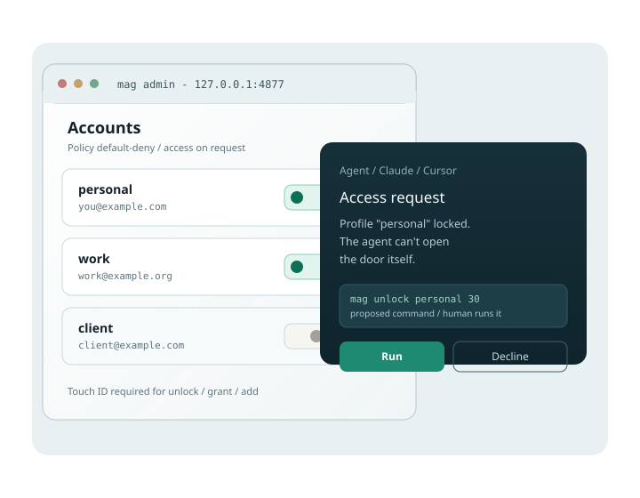
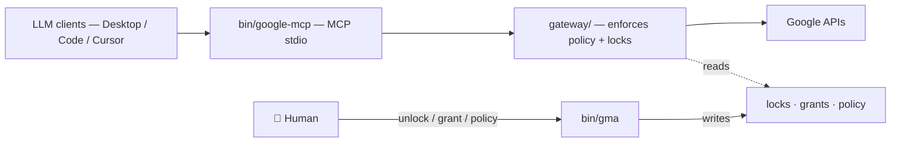

<div align="center">

<picture>
  <source media="(prefers-color-scheme: dark)" srcset="site/assets/readme-hero-dark.svg">
  
</picture>

<br>

[](https://github.com/elzinko/google-mcp-multi-account/actions/workflows/ci.yml) &nbsp;[](https://github.com/elzinko/google-mcp-multi-account/releases) &nbsp;[](LICENSE) &nbsp;[](#-development)

**[Quickstart](#-quickstart)** · **[How it works](#-how-it-works)** · **[Security](#-security)** · **[Docs](docs/)**

</div>

**Multi-account Google Workspace for LLM agents — 100 % local.** Connect Claude Desktop, Claude Code or Cursor to *several* Google accounts through a local [MCP](https://modelcontextprotocol.io) server. The agent can *ask* for access; only you grant it — every unlock, Drive grant and new account stays a human gesture.

---

## ✨ What you get

- **Multi-account, not one token** — each account is a *profile* with its own policy, locks and Drive zones. The agent targets an alias, never “your Google” as a whole.
- **The human holds every door** — unlock, Drive grant, new account, IAM fix: the agent *proposes the exact command* (elicitation), you run it.
- **Default-deny by design** — any undeclared service is refused; Gmail tools stop at the draft (no sending); Drive writes stay inside granted folders.
- **100 % local** — encrypted tokens (AES-256-GCM, master key in the macOS Keychain), per-client audit log. The only cloud step is a one-shot OAuth credential.
- **Scope today** — **Gmail + Drive** through MCP; **Calendar next**. Docs, Sheets and Tasks are reachable through the `gma` CLI.

## 🚀 Quickstart

macOS Apple Silicon.

**Prerequisite** — the upstream [`gws` CLI](https://github.com/googleworkspace/cli) (the Google Workspace CLI this project wraps) and Python 3:

```bash
brew install googleworkspace-cli
```

**1. Install** — no clone needed:

```bash
curl -fsSL https://raw.githubusercontent.com/elzinko/google-mcp-multi-account/main/install.sh | bash
```

This puts the latest release on your machine, `gma` on your PATH, and wires your Claude clients.

**2. Google setup** (~10 min, once) — an OAuth project in Google Cloud: [docs/setup-oauth.md](docs/setup-oauth.md). No account connects and no Google data flows until it's done — `setup_status` still runs to guide you.

**3. Connect an account**, then restart Claude Desktop (Cmd-Q):

```bash
gma add perso your.email@gmail.com    # "perso" = short name · the email pins the account
gma list             # profiles + state
```

Ask the agent: *“give me a rundown of my Google setup”* — it reads the state and proposes the exact command for each missing step; you run them. Update later, still clone-free: **`gma update`**. Full detail: [docs/mcp-setup.md](docs/mcp-setup.md) · [docs/setup-oauth.md](docs/setup-oauth.md).

## 🧭 How it works

The LLM **can never widen its own access**. Every door opens by a human gesture the agent can *request* but not perform.

<div align="center">

<br>
<sub><i>The local admin and an elicited access request — the agent proposes the exact command, you run it.</i></sub>
</div>



Why a wrapper, the local broker, who talks to whom: [docs/architecture.md](docs/architecture.md). Step-by-step walkthroughs: [diagrams/](diagrams/).

## 🔒 Security

Stance: **don’t trust the LLM by default** — it can *ask*, only a human opens. Per-profile locks (optional Touch ID), zoned Drive writes, no mail sending, encrypted tokens. Guarantees phase by phase, what is *not* yet covered, and how to report a flaw: [SECURITY.md](SECURITY.md) · [docs/threat-model.md](docs/threat-model.md). Honest self-critique (strengths, limits, competition): [docs/critique.md](docs/critique.md).

## 🛠 Development

```bash
./scripts/test.sh     # hermetic suite (policy, wrapper, gateway, broker) — no real account, no network
```

- **Commands** — `gma help` is the index of everything. LLM-guided manual tests: [tests/manuels/](tests/manuels/).
- **Releases** — the git **tag** is the source of truth; `gma release` derives semver from [conventional commits](https://www.conventionalcommits.org/). History: [CHANGELOG.md](CHANGELOG.md).

### Project structure

```
bin/       # google-mcp (MCP server) · gma (CLI wrapper) · google-broker
gateway/   # policy, locks, MCP server, signed elicitation
scripts/   # provision-gcp · update · release · test
docs/      # setup, usage, policies, architecture, security, critique
site/      # product landing + docs hub (English, FR/EN toggle)
features/  # backlog — one card per feature/bug
```

<details>
<summary><b>Naming</b> — product vs repo vs CLI</summary>

Product / MCP server `google-multi-account` (source of truth: `gateway/config.py` `PRODUCT_SLUG`) · git repo `google-mcp-multi-account` · CLI `gma` (this project's wrapper — what you run; formerly `gwsa`, still a deprecated alias) · MCP binary `google-mcp` · upstream dependency `gws` = the [Google Workspace CLI](https://github.com/googleworkspace/cli) that `gma` wraps (install it first).
</details>

## 📚 Further reading

| Topic | Where |
|---|---|
| Connect a client (Desktop, Code, Cursor); tools exposed | [docs/mcp-setup.md](docs/mcp-setup.md) |
| OAuth / GCP setup, IAM roles | [docs/setup-oauth.md](docs/setup-oauth.md) |
| CLI & web admin (`gma`, locks, Touch ID) | [docs/usage.md](docs/usage.md) |
| Policy model (default-deny, Drive zones, grants) | [docs/policies.md](docs/policies.md) |

## License

[MIT](LICENSE) — built in spare time. If it helps you, [buy me a coffee ☕](https://buymeacoffee.com/elzinko).
