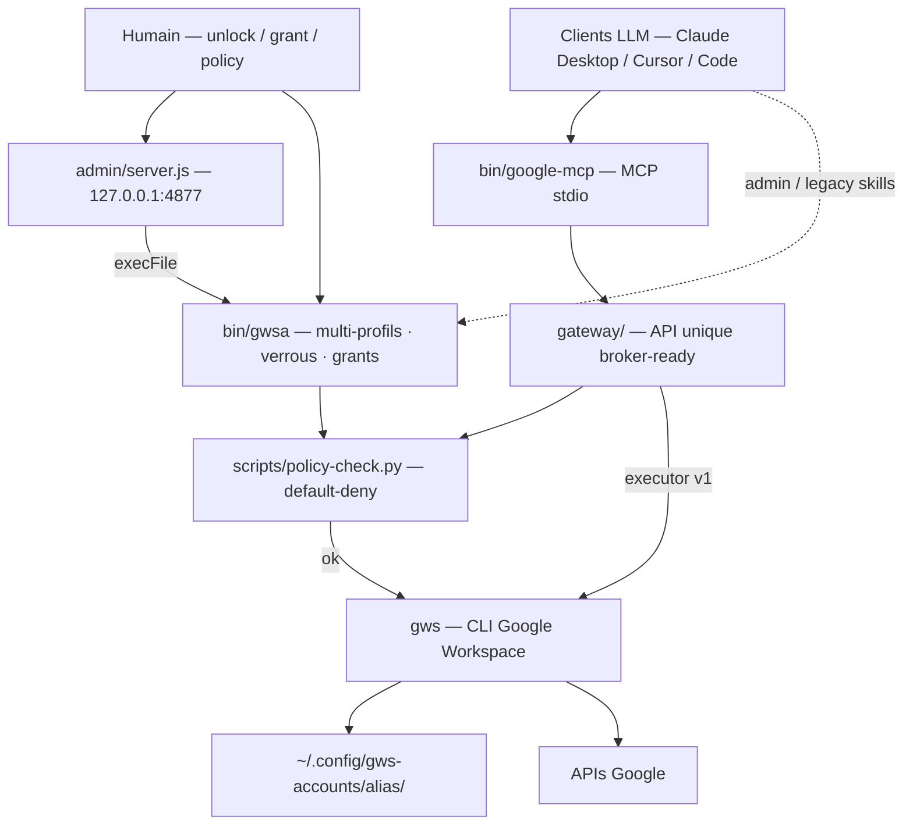

# google-mcp-multi-account

Brancher des agents LLM (Claude Desktop, Cursor, Claude Code, …) sur **plusieurs
comptes Google** — Gmail, Drive, Calendar, Docs, Sheets, Tasks — **100 % en local**.

> Serveur **MCP** local ([`bin/google-mcp`](bin/google-mcp)) + gateway
> ([`gateway/`](gateway/)) pour les clients MCP. Le wrapper [`bin/gwsa`](bin/gwsa)
> et les skills restent pour l’admin humain et Claude Code. Voir
> [docs/architecture.md](docs/architecture.md) (référence),
> [docs/mcp-setup.md](docs/mcp-setup.md) et [docs/threat-model.md](docs/threat-model.md).

## Architecture



**Rien ne tourne dans le cloud.** Le seul passage par la console Google Cloud est la
création *one-shot* d'un identifiant OAuth — voir [docs/setup-oauth.md](docs/setup-oauth.md).

**Pourquoi un wrapper + gateway ?** `gws` ne gère qu'un compte à la fois (le multi-comptes
natif a été retiré, cf. [issue #293](https://github.com/googleworkspace/cli/issues/293)).
`gwsa` / la gateway isolent chaque compte via `GOOGLE_WORKSPACE_CLI_CONFIG_DIR`.
Phase 2 prévue : remplacer l’executor par un **broker de tokens** sans changer les tools MCP.

## Installation

```bash
brew install googleworkspace-cli          # le CLI gws
ln -sf "$PWD/bin/gwsa" /opt/homebrew/bin/gwsa   # le wrapper dans le PATH
# MCP (Claude Desktop / Cursor / Code) — voir docs/mcp-setup.md
# brancher : …/bin/google-mcp
```

## Setup OAuth (one-shot, ~10 min)

**Voie automatique (recommandée)** — le script provisionne GCP via gcloud :

```bash
./scripts/provision-gcp.sh          # login → AFFICHE LE COMPTE ACTIF → confirme → provisionne
./scripts/provision-gcp.sh status   # état des lieux (lecture seule)
```

Il vérifie que tu es connecté avec le **bon compte** avant d'agir, crée le
projet (conteneur vide — rien n'est déployé, 0 €), active les 8 APIs, tente
l'écran de consentement par API, ouvre les pages console pour les deux seuls
gestes que Google interdit d'automatiser (client OAuth *Desktop app*,
publication), et range tout seul le `client_secret.json` téléchargé.

**Voie manuelle** — suivre [docs/setup-oauth.md](docs/setup-oauth.md), puis :

```bash
mkdir -p ~/.config/gws-accounts
mv ~/Downloads/client_secret_*.json ~/.config/gws-accounts/client_secret.json
```

## Connexion des comptes

```bash
gwsa add perso        # ouvre le navigateur → choisir le 1er compte Google
gwsa add assoc        # idem → choisir le 2e compte
gwsa list             # profils et état
```

Scopes par défaut (lecture **et** écriture) : Gmail (`gmail.modify`), Drive,
Calendar, Docs, Sheets, Slides, Tasks. Variantes : `gwsa add x --readonly`,
`gwsa add x --scopes <urls>`.

## Usage

```bash
gwsa perso gmail users messages list --params '{"userId":"me","maxResults":5}'
gwsa assoc drive files list --params '{"pageSize":10}'
gwsa perso calendar +agenda --today    # agenda du jour
gwsa perso auth status                 # état du token
```

### Connexion sur demande (élicitation)

Un profil peut être **verrouillé** : il reste connecté (token en place) mais
refuse toute commande tant que tu ne l'as pas déverrouillé explicitement —
le LLM qui se heurte au verrou doit te le demander.

```bash
gwsa lock zebra            # accès sur demande uniquement
gwsa zebra gmail …         # ✗ profil verrouillé 🔒 → le LLM doit demander
gwsa unlock zebra 30       # déverrouillé 30 min, reverrouillage automatique
```

[.claude/settings.json](.claude/settings.json) ajoute une seconde barrière,
native Claude Code : les commandes sur les profils sensibles (et `gwsa unlock`)
déclenchent une demande de permission explicite.

### Policy par service : qui a le droit de faire quoi

Chaque profil peut porter une policy (`~/.config/gws-accounts/<alias>/policy.json`,
appliquée par `scripts/policy-check.py` avant chaque commande). **Default-deny** :
un service absent de la policy est refusé (sauf `auth` / `schema`). Un service
configuré est fail closed : tout ce qui n'est pas explicitement autorisé est refusé.
`gwsa add` écrit une policy prudente automatiquement.

- **Drive** — par zones : lecture partout, écriture uniquement sous les dossiers
  autorisés (sous-dossiers compris — remontée des parents via l'API). Modes :
  `open`, `readonly`, `restricted`.
- **Gmail** — catégories `read`, `drafts`, `send`, `labels`, `update`, `delete`,
  `settings`. Le combo gagnant : *brouillons sans envoi* — le LLM prépare, tu envoies.
- **Agenda / Keep / autres** — `read`, `create`, `update`, `delete`, `share`.

```bash
gwsa policy mw allow "LLM"        # Drive : zone PERMANENTE sous le dossier « LLM »
gwsa policy mw show               # affiche la policy complète du profil
gwsa mw drive files create --json '{"name":"x"}'   # ✗ refusé (pas de parent autorisé)
gwsa mw gmail users messages send --json '…'       # ✗ refusé si "send": false
gwsa policy mw clear              # Drive repasse en open (autres services inchangés)
```

**Zones temporaires — le flux d'élicitation Drive.** Par défaut un profil en
`zonesOnly` n'a le droit d'écrire *nulle part*. Quand un LLM veut écrire quelque
part, il se heurte à un refus qui lui dit quoi demander ; c'est **toi** qui
accordes, pour une durée limitée (défaut 8 h, expiration automatique — donc à
re-demander à chaque session de travail) :

```bash
gwsa grant coloc "Compta 2026" 4   # écriture sous ce dossier pendant 4 h
gwsa grants coloc                  # autorisations temporaires actives
gwsa grant coloc revoke <folderId> # révoquer avant l'expiration
```

Chaque refus est journalisé et invite le LLM à *demander* l'élargissement —
l'élicitation, encore. *Limite assumée : c'est le wrapper qui contrôle, pas
Google — le seul verrou 100 % côté Google serait le scope `drive.file`.*

### Interface d'admin web

```bash
node admin/server.js       # → http://127.0.0.1:4877 (local uniquement)
```

Tout se pilote depuis le navigateur : **connecter un compte** (alias + email
attendu — l'onglet Google s'ouvre avec le bon compte présélectionné et la
connexion est refusée si tu choisis le mauvais), **verrouiller/déverrouiller**
(minutes ou `off`), **éditer la policy** service par service avec préréglages
(« prudent » : Drive zones, Gmail brouillons sans envoi, Agenda lecture, Keep
lecture + création), **journal des accès** (qui a fait quoi sur quel compte —
les LLM s'identifient via la variable `GWSA_CLIENT`), **doc intégrée** (❓) et
**gros bouton Révoquer** (supprime les tokens du poste, accès coupé immédiatement).

Ajout d'un dossier autorisé sans jamais saisir d'ID : **🔍 recherche par nom**
(plusieurs correspondances → liste de choix avec le chemin complet) ou **📂
navigation** dans Mon Drive (Ouvrir/Choisir), puis durée : temporaire (défaut
8 h) ou permanent. *(Pourquoi des IDs en interne ? Les noms de dossiers Drive ne
sont pas uniques et changent au gré des renommages/déplacements ; l'ID est la
seule référence stable. L'interface fait la conversion nom → ID pour toi.)*

Sécurité : serveur lié à 127.0.0.1 seulement, en-tête custom obligatoire
(anti-CSRF), Origin contrôlée, aucune dépendance npm (mermaid vendorisé en
local), actions déléguées à `bin/gwsa` (`execFile`, jamais de shell).

### Authentification forte (Touch ID) — optionnelle

```bash
gwsa strongauth on      # unlock et grant exigeront Touch ID / Apple Watch
gwsa strongauth status  #   (ou mot de passe de session macOS en secours)
gwsa strongauth off     # désactivation (elle-même protégée par Touch ID)
```

Une fois activée, chaque déverrouillage de profil et chaque autorisation de
zone Drive déclenche la boîte de dialogue biométrique système
([scripts/touchid.swift](scripts/touchid.swift), framework LocalAuthentication
d'Apple, 100 % local). L'approbation d'élicitation ne peut alors plus venir
que d'un humain physiquement présent devant le Mac — un LLM (ou un script)
ne peut pas la simuler.

### Serveur MCP (recommandé pour les données)

Architecture et contrôles de sécurité : [docs/architecture.md](docs/architecture.md).  
Branchement Desktop / Cursor / Code : [docs/mcp-setup.md](docs/mcp-setup.md).  
Limites Phase 1 / broker Phase 2 : [docs/threat-model.md](docs/threat-model.md).

### Depuis Claude Code

Ouvrir une session dans ce repo : les skills `.claude/skills/gws-*` et les
consignes [CLAUDE.md](CLAUDE.md) sont chargés automatiquement. Demander en
langage naturel, par ex. « liste mes 5 derniers mails du compte perso ».

## Sécurité

- Tokens OAuth chiffrés (AES-256-GCM) dans `~/.config/gws-accounts/<alias>/credentials.enc` ;
  clé maître dans le Trousseau macOS. Rien de tout ça n'est dans le repo (`.gitignore`).
- Le `client_secret.json` d'une app *Desktop* n'est pas un vrai secret au sens
  strict, mais on le garde hors du repo par principe.
- Les scopes par défaut excluent la suppression définitive Gmail.

## Limites connues

- **App OAuth « non vérifiée »** : à la première connexion de chaque compte,
  Google affiche un avertissement → *Paramètres avancés* → *Accéder à…*. Normal
  pour une app personnelle (< 100 utilisateurs).
- **Mode Testing = tokens 7 jours** : tant que l'app OAuth est en statut
  *Testing*, chaque compte doit se reconnecter tous les 7 jours. Publier l'app
  en *Production* (voir docs/setup-oauth.md, étape 5) rend les tokens durables.
- Quotas API gratuits largement suffisants pour un usage personnel. Coût : 0 €.

## Maintenance

- `./scripts/sync-skills.sh` — resynchronise les skills officiels après une MàJ de gws.
- Suivre l'[issue #293](https://github.com/googleworkspace/cli/issues/293) : si le
  multi-comptes natif (`--account`) revient dans gws, ce wrapper deviendra un alias trivial.
