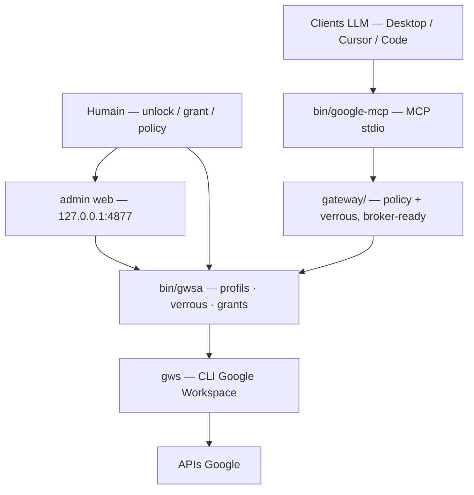

# google-mcp-multi-account

**Brancher des agents LLM (Claude Desktop, Cursor, Claude Code, …) sur plusieurs
comptes Google — Gmail, Drive, Calendar, Docs, Sheets, Tasks — 100 % en local.**

[](https://github.com/elzinko/google-mcp-multi-account/actions/workflows/ci.yml)
[](LICENSE)
[](SECURITY.md)
[](#sécurité)
[](docs/usage.md)
[](https://buymeacoffee.com/elzinko)

Serveur **MCP** ([Model Context Protocol](https://modelcontextprotocol.io)) local
([`bin/google-mcp`](bin/google-mcp)) + gateway
([`gateway/`](gateway/)) pour les clients LLM ; le wrapper [`bin/gwsa`](bin/gwsa)
et l'admin web pour l'humain. **Rien ne tourne dans le cloud** : le seul passage
par la console Google Cloud est la création *one-shot* d'un identifiant OAuth.

> **Plateforme : macOS (Apple Silicon).** Requis aujourd'hui — Trousseau (clé de
> chiffrement), Touch ID, chemins Homebrew. Rendre le projet multi-plateforme
> (Linux, Intel) et l'ouvrir à d'autres utilisateurs (doc EN, packaging) est à la
> roadmap : [épic 0017](features/0017-generaliser-autres-utilisateurs.md).

## Quickstart (3 étapes)

**1 · Provisionner le projet Google Cloud** (une fois, ~10 min) :

```bash
git clone https://github.com/elzinko/google-mcp-multi-account.git
cd google-mcp-multi-account
brew install googleworkspace-cli                    # le CLI gws
ln -sf "$PWD/bin/gwsa" "$(brew --prefix)/bin/gwsa"  # le wrapper dans le PATH
./scripts/provision-gcp.sh                          # crée le projet, active les APIs, te guide
```

Le script fait tout l'automatisable et te guide pour les **deux seuls gestes que
Google interdit d'automatiser** (créer le client OAuth *Desktop app*, publier
l'app), puis range le `client_secret.json`. Le projet GCP reste une coquille
vide : rien de déployé, 0 €.
Détail / voie manuelle : [docs/setup-oauth.md](docs/setup-oauth.md).

**2 · Brancher Claude Desktop** (une fois) :

```bash
./scripts/install-claude-desktop.sh
```

Le script trouve la config, ajoute l'entrée MCP sans toucher à tes autres
serveurs, fait un backup — relançable sans risque. Puis **redémarrer Claude
Desktop** (Cmd-Q, puis relancer — fermer la fenêtre ne suffit pas). Autres
clients (Cursor, Claude Code) et voie manuelle : [docs/mcp-setup.md](docs/mcp-setup.md).

**3 · Demander au LLM d'initialiser tes comptes** — par exemple : « fais le
point sur mon setup Google ». Il lit l'état du setup (tool `setup_status`), te
présente ce qui manque, et te propose **la commande exacte** pour chaque étape —
c'est toi qui l'exécutes. Chaque compte connecté devient un **profil**, désigné
par l'**alias** que tu choisis :

```bash
gwsa add perso        # « perso » = ton alias · navigateur → choisir le compte → accepter
gwsa add assoc        # répéter pour chaque compte · gwsa list pour voir l'état
```

> Un `403` au premier appel ? Il manque un rôle IAM au compte — le setup le
> détecte et affiche la commande exacte ([détail](docs/setup-oauth.md)).

## Comment ça marche

**Le LLM ne peut jamais élargir son propre accès.** Chaque porte — verrou de
profil, zone d'écriture Drive, nouveau compte, rôle IAM — s'ouvre par un geste
humain, que le LLM sait *demander* proprement (élicitation) mais jamais exécuter.
Les quatre parcours, versionnés avec leur prose source dans [diagrams/](diagrams/) :

- **[Setup initial](diagrams/onboarding-setup-initial/)** — les 3 étapes ci-dessus, le reste guidé.
- **[Lire ses données](diagrams/lecture-donnees-elicitee/)** — verrou → unlock élicité → lecture sous policy.
- **[Connecter un compte](diagrams/onboarding-add-account-elicite/)** — double barrière physique (Touch ID + consentement OAuth).
- **[Réparer la dérive IAM](diagrams/onboarding-reparation-iam/)** — détection par deux chemins (`403` rencontré par le LLM, ou contrôle `provision-gcp.sh status`), réparation humaine idempotente.



*Pourquoi un wrapper ?* `gws` ne gère qu'un compte à la fois (multi-comptes natif
retiré, [issue #293](https://github.com/googleworkspace/cli/issues/293)) ; `gwsa`
/ la gateway isolent chaque compte via `GOOGLE_WORKSPACE_CLI_CONFIG_DIR`. Un
broker local ([`bin/google-broker`](bin/google-broker)) est le seul process qui
exécute `gws` pour les accès aux **données** du MCP. Référence :
[docs/architecture.md](docs/architecture.md).

## Utiliser

- **Depuis un LLM** — les tools MCP par groupe (découverte, Gmail, Drive,
  élicitation, diagnostic) : [docs/mcp-setup.md](docs/mcp-setup.md). En Claude
  Code, demander en langage naturel (« liste mes 5 derniers mails du compte perso »).
- **En ligne de commande & admin web** (`gwsa`, verrous, `gwsa admin`, Touch ID) :
  [docs/usage.md](docs/usage.md).
- **Le modèle de policy** (default-deny par service, zones Drive, grants) :
  [docs/policies.md](docs/policies.md).

## Sécurité

Le parti pris : **ne pas faire confiance au LLM par défaut**. Il peut *demander*
un accès (élicitation) ; seul un humain l'ouvre. Concrètement :

- **Default-deny** — tout service non déclaré dans la policy d'un profil est
  refusé ; un nouveau compte démarre avec une policy prudente.
- **Aucun envoi de mail** — les tools MCP s'arrêtent au brouillon Gmail.
- **Écriture Drive zonée** — limitée à des dossiers autorisés, temporaires par
  défaut.
- **Verrous par profil** — un profil verrouillé refuse tout accès aux données,
  MCP compris, jusqu'à un déverrouillage humain, optionnellement sous **Touch ID**.
- **Tokens chiffrés** — AES-256-GCM sur disque, clé maître dans le Trousseau
  macOS ; rien de sensible dans le repo.
- **Journal d'audit** — chaque appel est tracé avec le client qui l'a émis.

Le détail — garanties phase par phase, ce qui n'est **pas** encore garanti, et
comment signaler une faille : [SECURITY.md](SECURITY.md) ·
[docs/threat-model.md](docs/threat-model.md).

## Limites connues

- **App OAuth « non vérifiée »** : avertissement Google à la 1re connexion de
  chaque compte (*Paramètres avancés* → *Accéder à…*). Normal pour une app perso.
- **Mode Testing = tokens 7 jours** : publier l'app en *Production*
  ([setup-oauth.md](docs/setup-oauth.md) étape 5) rend les tokens durables.
- Quotas API gratuits largement suffisants pour un usage personnel. Coût : 0 €.

> 🔍 **Regard critique complet** (forces, limites, sécurité, position face à la
> concurrence, risques d'obsolescence) : [docs/critique.md](docs/critique.md).

## Tests

- **Automatiques** : `./scripts/test.sh` — suite hermétique (policy, wrapper,
  gateway, broker) ; aucun compte réel, aucun réseau.
- **Manuels** : [tests/manuels/](tests/manuels/) — guidés par un LLM sur de vrais
  comptes ; il suffit de dire « lance le test manuel drive-2-comptes » (prérequis :
  un dossier bac à sable `ZZ-TESTS` à la racine des Drive concernés).

## Maintenance

- `./scripts/sync-skills.sh` — resynchronise les skills officiels après une MàJ de gws.
- Si le multi-comptes natif (`--account`) revient dans gws
  ([issue #293](https://github.com/googleworkspace/cli/issues/293)), ce wrapper
  deviendra un alias trivial.

## Soutenir

Projet développé sur temps libre, sous licence [MIT](LICENSE). S'il te rend
service, tu peux [m'offrir un café ☕](https://buymeacoffee.com/elzinko).
