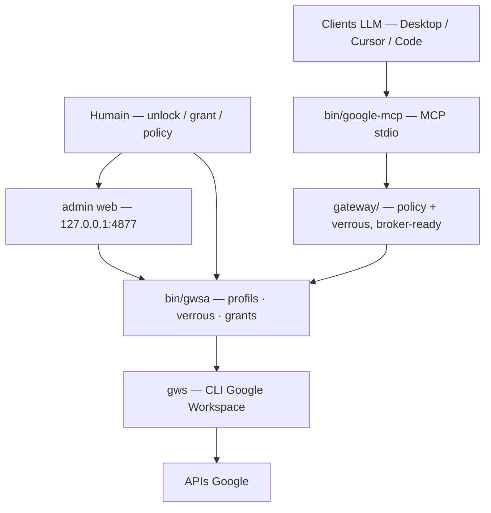

# google-mcp-multi-account

Brancher des agents LLM (Claude Desktop, Cursor, Claude Code, …) sur **plusieurs
comptes Google** — Gmail, Drive, Calendar, Docs, Sheets, Tasks — **100 % en local**.

Serveur **MCP** local ([`bin/google-mcp`](bin/google-mcp)) + gateway
([`gateway/`](gateway/)) pour les clients LLM ; le wrapper [`bin/gwsa`](bin/gwsa)
et l'admin web pour l'humain. **Rien ne tourne dans le cloud** : le seul passage
par la console Google Cloud est la création *one-shot* d'un identifiant OAuth.

> **Plateforme : macOS (Apple Silicon).** Requis aujourd'hui — Trousseau (clé de
> chiffrement), Touch ID, chemins Homebrew. Rendre le projet multi-plateforme
> (Linux, Intel) et l'ouvrir à d'autres utilisateurs (doc EN, packaging) est à la
> roadmap : [épic 0014](features/0014-generaliser-autres-utilisateurs.md).

## Quickstart (3 étapes)

**1 · Provisionner le projet Google Cloud** (une fois, ~10 min) :

```bash
brew install googleworkspace-cli                 # le CLI gws
ln -sf "$PWD/bin/gwsa" /opt/homebrew/bin/gwsa    # le wrapper dans le PATH
./scripts/provision-gcp.sh                        # crée le projet, active les APIs, te guide
```

Le script fait tout l'automatisable et te guide pour les **deux seuls gestes que
Google interdit d'automatiser** (créer le client OAuth *Desktop app*, publier
l'app), puis range le `client_secret.json`. Conteneur vide, rien de déployé, 0 €.
Détail / voie manuelle : [docs/setup-oauth.md](docs/setup-oauth.md).

**2 · Brancher le serveur MCP** dans ton client LLM (une fois) — bloc de config
pour Claude Desktop / Cursor / Claude Code : [docs/mcp-setup.md](docs/mcp-setup.md).

**3 · Demander au LLM d'initialiser tes comptes.** Il lit l'état du setup (tool
`setup_status`), te présente ce qui manque, et te propose **la commande exacte**
pour chaque étape — c'est toi qui l'exécutes :

```bash
gwsa add perso        # navigateur → choisir le compte → accepter les accès
gwsa add assoc        # répéter pour chaque compte · gwsa list pour voir l'état
```

> ⚠️ Chaque compte connecté (hors propriétaire du projet) doit recevoir le rôle
> IAM `serviceUsageConsumer`, sinon `403` au 1er appel. `gwsa add` et
> `./scripts/provision-gcp.sh status` le détectent et affichent la commande ;
> `./scripts/provision-gcp.sh sync-iam` répare tout d'un coup. Voir
> [setup-oauth.md §7](docs/setup-oauth.md).

## Comment ça marche

**Le LLM ne peut jamais élargir son propre accès.** Chaque porte — verrou de
profil, zone d'écriture Drive, nouveau compte, rôle IAM — s'ouvre par un geste
humain, que le LLM sait *demander* proprement (élicitation) mais jamais exécuter.
Les quatre parcours, versionnés avec leur prose source dans [diagrams/](diagrams/) :

- **[Setup initial](diagrams/onboarding-setup-initial/)** — les 3 étapes ci-dessus, le reste guidé.
- **[Lire ses données](diagrams/lecture-donnees-elicitee/)** — verrou → unlock élicité → lecture sous policy.
- **[Connecter un compte](diagrams/onboarding-add-account-elicite/)** — double barrière physique (Touch ID + consentement OAuth).
- **[Réparer la dérive IAM](diagrams/onboarding-reparation-iam/)** — détection ×2, réparation humaine idempotente.



*Pourquoi un wrapper ?* `gws` ne gère qu'un compte à la fois (multi-comptes natif
retiré, [issue #293](https://github.com/googleworkspace/cli/issues/293)) ; `gwsa`
/ la gateway isolent chaque compte via `GOOGLE_WORKSPACE_CLI_CONFIG_DIR`. Un
broker local ([`bin/google-broker`](bin/google-broker)) est le seul process qui
exécute `gws` pour le MCP. Référence : [docs/architecture.md](docs/architecture.md).

## Utiliser

- **Depuis un LLM** — les tools MCP par groupe (découverte, Gmail, Drive,
  élicitation, diagnostic) : [docs/mcp-setup.md](docs/mcp-setup.md). En Claude
  Code, demander en langage naturel (« liste mes 5 derniers mails du compte perso »).
- **En ligne de commande & admin web** (`gwsa`, verrous, `gwsa admin`, Touch ID) :
  [docs/usage.md](docs/usage.md).
- **Le modèle de policy** (default-deny par service, zones Drive, grants) :
  [docs/policies.md](docs/policies.md).

## Sécurité

- Tokens OAuth chiffrés (AES-256-GCM) dans `~/.config/gws-accounts/<alias>/`,
  clé maître dans le Trousseau macOS — rien de tout ça dans le repo (`.gitignore`).
- **Default-deny** par service ; brouillons Gmail sans envoi ; scopes par défaut
  hors suppression définitive. Détails & limites : [docs/threat-model.md](docs/threat-model.md).
- `gwsa strongauth on` exige Touch ID (présence humaine) pour unlock / grant / add.

## Limites connues

- **App OAuth « non vérifiée »** : avertissement Google à la 1re connexion de
  chaque compte (*Paramètres avancés* → *Accéder à…*). Normal pour une app perso.
- **Mode Testing = tokens 7 jours** : publier l'app en *Production*
  ([setup-oauth.md](docs/setup-oauth.md) étape 5) rend les tokens durables.
- Quotas API gratuits largement suffisants pour un usage personnel. Coût : 0 €.

> 🔍 **Regard critique complet** (forces, limites, sécurité, position face à la
> concurrence, risques d'obsolescence) : [docs/critique.md](docs/critique.md).

## Tests

- **Automatiques** : `./scripts/test.sh` — suite hermétique (policy, wrapper,
  gateway, broker) ; aucun compte réel, aucun réseau.
- **Manuels** : [tests/manuels/](tests/manuels/) — guidés par un LLM sur de vrais
  comptes ; il suffit de dire « lance le test manuel drive-2-comptes » (prérequis :
  un dossier bac à sable `ZZ-TESTS` à la racine des Drive concernés).

## Maintenance

- `./scripts/sync-skills.sh` — resynchronise les skills officiels après une MàJ de gws.
- Si le multi-comptes natif (`--account`) revient dans gws
  ([issue #293](https://github.com/googleworkspace/cli/issues/293)), ce wrapper
  deviendra un alias trivial.
