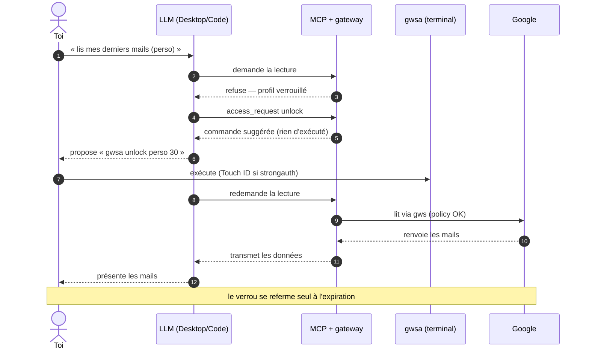

# "Lire ses données — verrou, unlock élicité, lecture sous policy"

> Diagramme généré par **ezk-diagram**. Source de vérité : [`description.md`](description.md) (prose).
> Ce fichier est **généré** (explication comprise) — ne pas l’éditer à la main (il serait écrasé au prochain `publish`).

## Ce que montre ce diagramme

Ce que montre ce diagramme : au quotidien, même la simple lecture des données
passe par une porte fermée par défaut. Le premier appel du LLM se heurte au
verrou du profil — un refus voulu, qui lui dit exactement quoi demander. Le
LLM te propose la commande de déverrouillage ; c'est toi qui l'exécutes, avec
Touch ID si l'authentification forte est activée. Une fois le verrou levé
pour la durée que tu as choisie, la lecture passe (sous le contrôle de la
policy) et les données remontent. Le verrou se referme ensuite tout seul :
redemander à la prochaine session n'est pas un bug, c'est le mode « accès
sur demande » qui structure le produit. L'écriture dans Drive suit la même
logique, avec en plus une zone temporaire à accorder dossier par dossier.

**Vues partageables** · [Éditer sur mermaid.live](https://mermaid.live/edit#pako:eNp9k89qGzEQxl9l0CVratNCb3tYKDaE0nVriKGXhaJqP69FJM1Wf5yYEOhD9AF6XfoIvWXfJE9S1uskhw09DSN9-mnmG-lOKK4hchHwI8EprLRsvLSVIyKSKbJL9jv8OVeRPW1Zj2krfdRKt9JFKss1yXAK2QrhOnL7dsk1ZlPperkZpEN4Q42MuJHHqery69WHQdbcBElZhLfaSfMK7pK5MajcuLNlvSiKslzn9PCHjA5kEaiGdxo-kJXaBMpa-MAzevg7HirL9aIo1stNTjWsdDXISDJQMXmMkvVys3gCe-xSAD3-_EWt5502dID3nLQxfTchSqUQwjc_GBwiJWdYXU-hiu14c0hN03e-70CZ13BUX-C271SKfTd7oS-KYss6HypoOWDo9mTVyKdTh_T-3XOPozGDqzmdeaBsy0nt6eOKgqYQPbtGprifTZrw-J8xRTEOISejIx20HEqhrGWj1ZG-fDrzRtHihekOrEEG57lMTYleumART5qanes7hNc86LsAFyeszxxBfMDp0c6fi8R5YBQwDBPeggKSof43mQvcttrLqNlVTsyFhbdS1yIXdwO0EnEPi0rkVIkaO5lMrETl7sVcDP_l6uiUyKNPmIvU1jI-falx8f4fwA4rtg==) · [Image PNG (mermaid.ink)](https://mermaid.ink/img/pako:eNp9k89qGzEQxl9l0CVratNCb3tYKDaE0nVriKGXhaJqP69FJM1Wf5yYEOhD9AF6XfoIvWXfJE9S1uskhw09DSN9-mnmG-lOKK4hchHwI8EprLRsvLSVIyKSKbJL9jv8OVeRPW1Zj2krfdRKt9JFKss1yXAK2QrhOnL7dsk1ZlPperkZpEN4Q42MuJHHqery69WHQdbcBElZhLfaSfMK7pK5MajcuLNlvSiKslzn9PCHjA5kEaiGdxo-kJXaBMpa-MAzevg7HirL9aIo1stNTjWsdDXISDJQMXmMkvVys3gCe-xSAD3-_EWt5502dID3nLQxfTchSqUQwjc_GBwiJWdYXU-hiu14c0hN03e-70CZ13BUX-C271SKfTd7oS-KYss6HypoOWDo9mTVyKdTh_T-3XOPozGDqzmdeaBsy0nt6eOKgqYQPbtGprifTZrw-J8xRTEOISejIx20HEqhrGWj1ZG-fDrzRtHihekOrEEG57lMTYleumART5qanes7hNc86LsAFyeszxxBfMDp0c6fi8R5YBQwDBPeggKSof43mQvcttrLqNlVTsyFhbdS1yIXdwO0EnEPi0rkVIkaO5lMrETl7sVcDP_l6uiUyKNPmIvU1jI-falx8f4fwA4rtg==)

Les liens mermaid.live/mermaid.ink encodent le diagramme dans l’URL (service externe) — pratique pour partager/éditer vite ; la vue sans service tiers reste ce README rendu par GitHub.
