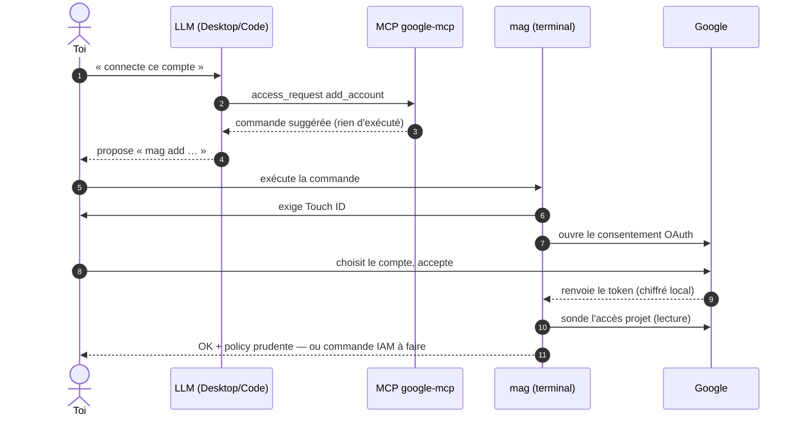

# "Connexion d'un nouveau compte — élicitation à authentification forte"

> Diagramme généré par **ezk-diagram**. Source de vérité : [`description.md`](description.md) (prose).
> Ce fichier est **généré** (explication comprise) — ne pas l’éditer à la main (il serait écrasé au prochain `publish`).

## Ce que montre ce diagramme

Ce que montre ce diagramme : un LLM peut demander la connexion d'un nouveau
compte Google, mais ne peut jamais la faire lui-même. Sa demande passe par le
serveur MCP, qui répond uniquement par la commande exacte à exécuter — rien
n'est créé à ce stade. C'est toi qui lances cette commande, et deux barrières
physiques se dressent alors : Touch ID (présence devant le Mac) puis le
consentement OAuth dans le navigateur (choisir le compte, accepter). Une fois
connecté, le compte reçoit d'office une policy prudente, et une sonde vérifie
immédiatement son accès au projet Google Cloud — si le rôle IAM manque, la
commande de réparation s'affiche tout de suite plutôt que d'échouer en
silence au premier appel.

**Vues partageables** · [Éditer sur mermaid.live](https://mermaid.live/edit#pako:eNptU8FqGzEQ_ZVBlzjUpvc9LBgbQuguMcTQy0JQR-O1ml3NVhqlCSGQj-gH9FRq-gm9Zf8kX1K0aztN05OQ5um9N2-ke4VsSGUq0JdIDmlpde11WzkAAB2FXWw_kd_vUdjDmu247bQXi7bTTqAoStBhWCZLCtfC3fsFGzp9Cy0XqwRNS81cNzRrsXsLO_t4OU-4-mvQMBHyrXW6-Q_f2UBSubGyZjvL86IoM3j6BcjOEQoBEiC3nRA8_R6BRVHO8rxcrDLQiBTClU8ZBAFtzJVG5OhkhJaL1exAity22hmCEOu63_l-RzDxlhyYE7rtdxil352-SMzyfM02g85zx4GSqaEjbQw8P_442hl9p6Yz2PMQNPqoN6JS_cBIt7YmWHPELZwvX9XHSDLgeOMJmtS7C-SEWnICF_Mo21eqezhu2QYr44UU1nSIppOD-jiuo09P7obtICB8TQ4muLWbje930DAeh_WPqcApvuZEI_Y_QwrmMwlMGkKJnv6-c-j04gO8g44bi3fQ-WhSJ_D8-A04vszjfF5C_x022nqqnJqqlnyrrVGZuk-clZIttVSpDCplaKNjI5Wq3IOaqvTQL-8cqkx8pKmKndFy-Avj4cMfriAU9w==) · [Image PNG (mermaid.ink)](https://mermaid.ink/img/pako:eNptU8FqGzEQ_ZVBlzjUpvc9LBgbQuguMcTQy0JQR-O1ml3NVhqlCSGQj-gH9FRq-gm9Zf8kX1K0aztN05OQ5um9N2-ke4VsSGUq0JdIDmlpde11WzkAAB2FXWw_kd_vUdjDmu247bQXi7bTTqAoStBhWCZLCtfC3fsFGzp9Cy0XqwRNS81cNzRrsXsLO_t4OU-4-mvQMBHyrXW6-Q_f2UBSubGyZjvL86IoM3j6BcjOEQoBEiC3nRA8_R6BRVHO8rxcrDLQiBTClU8ZBAFtzJVG5OhkhJaL1exAity22hmCEOu63_l-RzDxlhyYE7rtdxil352-SMzyfM02g85zx4GSqaEjbQw8P_442hl9p6Yz2PMQNPqoN6JS_cBIt7YmWHPELZwvX9XHSDLgeOMJmtS7C-SEWnICF_Mo21eqezhu2QYr44UU1nSIppOD-jiuo09P7obtICB8TQ4muLWbje930DAeh_WPqcApvuZEI_Y_QwrmMwlMGkKJnv6-c-j04gO8g44bi3fQ-WhSJ_D8-A04vszjfF5C_x022nqqnJqqlnyrrVGZuk-clZIttVSpDCplaKNjI5Wq3IOaqvTQL-8cqkx8pKmKndFy-Avj4cMfriAU9w==)

Les liens mermaid.live/mermaid.ink encodent le diagramme dans l’URL (service externe) — pratique pour partager/éditer vite ; la vue sans service tiers reste ce README rendu par GitHub.
