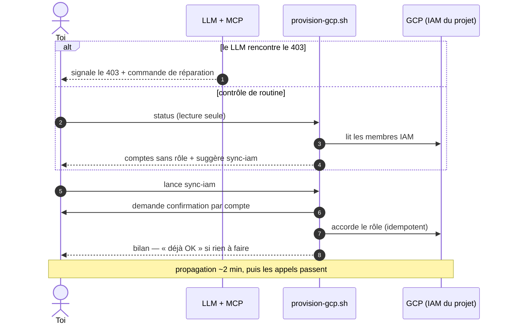

# "Dérive IAM — détection par deux chemins, réparation humaine idempotente"

> Diagramme généré par **ezk-diagram**. Source de vérité : [`description.md`](description.md) (prose).
> Ce fichier est **généré** (explication comprise) — ne pas l’éditer à la main (il serait écrasé au prochain `publish`).

## Ce que montre ce diagramme

Ce que montre ce diagramme : un compte Google fraîchement connecté peut être
techniquement valide et pourtant refusé à chaque appel, faute d'un rôle sur
le projet Google Cloud de l'application. Cette dérive se voit désormais par
deux chemins — soit le LLM tombe dessus en travaillant et te signale quoi
faire, soit tu lances le contrôle de routine en lecture seule qui liste les
comptes en défaut. Dans les deux cas, la réparation reste ton geste : une
seule commande parcourt les comptes manquants, demande ta confirmation pour
chacun, et peut être relancée sans risque — quand tout est en place, elle ne
fait rien.

**Vues partageables** · [Éditer sur mermaid.live](https://mermaid.live/edit#pako:eNplk89qGzEQxl9l0MnG3lLanvawEFwIoXZriI97kaXxZoI0UvUnEEJKH6IPkGNDr731ln2TPknRrrchsS5C4jfzffok3QnlNIpaRPyakRV-JNkFaVsGAJA5Oc52j-G4VskF2Dkal16GRIq85ATr9QZkHKYFbFbbU-JSBfKpQD64G4rkuOqUfxOvTtnz1baAZZpdnG1A51J0jWne8tGKSWBw0AvIynEKWDY-vH0_AmWs15uqapqdoxoidSzNxMAClLNWskbQCKF_9DLIRO7YHk1EGLr2v82IuJyI8bn5zlHVNOOpaohJphxhZlClHBAiZoPzZ3rkqqY5X21rMFTcR7Bo9wEjXJxtTtDJuHLWJ4wQJUcY7Swg5q7rfxadW1YVTReGrKeAXtozktVr-L-lQUbjmIZyfKBghyzKnRz1X5UMp5BKuaCHSEdfM9JovUvIaf6iYBLZk5EMf7__gKdfoPvH6_4BvnyCpz8QCQIhQ_8AB0nhqPfZJQR3g8OjWw6iPjgvu9Het3dgiZfgM8UhT-k9mghexoicWhZLYTFYSVrU4q70bEW6QoutqKEVGg8ym9SKlu_FUpTnfnnLStQpZFyK7LVM048YN-__AbD2FBU=) · [Image PNG (mermaid.ink)](https://mermaid.ink/img/pako:eNplk89qGzEQxl9l0MnG3lLanvawEFwIoXZriI97kaXxZoI0UvUnEEJKH6IPkGNDr731ln2TPknRrrchsS5C4jfzffok3QnlNIpaRPyakRV-JNkFaVsGAJA5Oc52j-G4VskF2Dkal16GRIq85ATr9QZkHKYFbFbbU-JSBfKpQD64G4rkuOqUfxOvTtnz1baAZZpdnG1A51J0jWne8tGKSWBw0AvIynEKWDY-vH0_AmWs15uqapqdoxoidSzNxMAClLNWskbQCKF_9DLIRO7YHk1EGLr2v82IuJyI8bn5zlHVNOOpaohJphxhZlClHBAiZoPzZ3rkqqY5X21rMFTcR7Bo9wEjXJxtTtDJuHLWJ4wQJUcY7Swg5q7rfxadW1YVTReGrKeAXtozktVr-L-lQUbjmIZyfKBghyzKnRz1X5UMp5BKuaCHSEdfM9JovUvIaf6iYBLZk5EMf7__gKdfoPvH6_4BvnyCpz8QCQIhQ_8AB0nhqPfZJQR3g8OjWw6iPjgvu9Het3dgiZfgM8UhT-k9mghexoicWhZLYTFYSVrU4q70bEW6QoutqKEVGg8ym9SKlu_FUpTnfnnLStQpZFyK7LVM048YN-__AbD2FBU=)

Les liens mermaid.live/mermaid.ink encodent le diagramme dans l’URL (service externe) — pratique pour partager/éditer vite ; la vue sans service tiers reste ce README rendu par GitHub.
