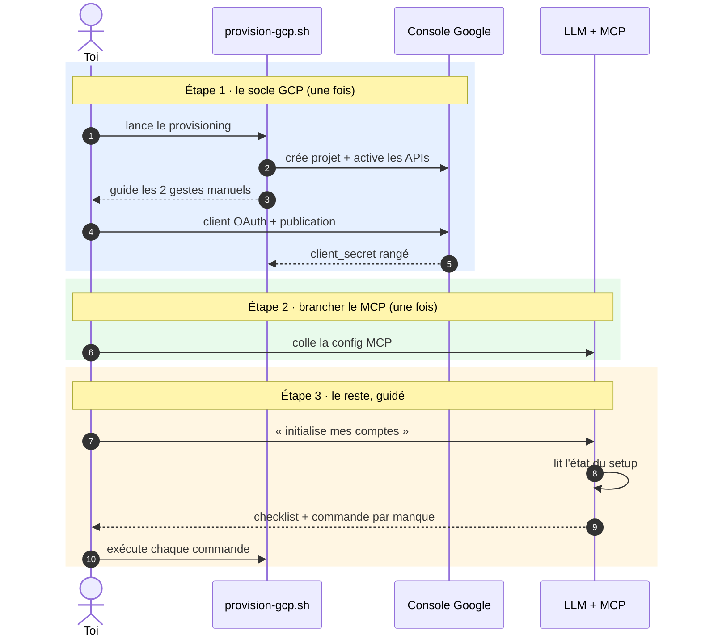

# "Onboarding — setup initial en trois étapes (cible)"

> Diagramme généré par **ezk-diagram**. Source de vérité : [`description.md`](description.md) (prose).
> Ce fichier est **généré** (explication comprise) — ne pas l’éditer à la main (il serait écrasé au prochain `publish`).

## Ce que montre ce diagramme

Ce que montre ce diagramme : l'installation complète tient en trois étapes
humaines. D'abord le socle Google Cloud, une seule fois — un script fait tout
ce qui est automatisable et te guide pour les deux gestes que Google impose de
faire à la main dans sa console. Ensuite, brancher le serveur MCP dans ton
client LLM, une seule fois aussi. Enfin, tout le reste se passe en dialogue :
tu demandes au LLM d'initialiser tes comptes, il lit l'état du setup, te
présente ce qui manque, et te propose pour chaque manque la commande exacte à
exécuter toi-même. Lui n'exécute jamais rien qui élargisse l'accès — c'est le
principe d'élicitation qui structure tout le projet.

**Vues partageables** · [Éditer sur mermaid.live](https://mermaid.live/edit#pako:eNqNlM-O0zAQxl9l5AuLmiJIKUg5VFoVCSGlUGl7jIRcZ5oMOHZqjyvQah-AR6l4AA57a18Muek_thSRQxLH3-eZ-Y2de6FsiSITHpcBjcJ3JCsnm8IAAMjA1oRmjm4_VmwdzCx1w1Y6JkWtNAx3ylHLID20zq7IkzX9SrUvfH2pHVvjrcYoPry-t7bSeCnN80mUxUcPJuNpYTqNQ8XgqvlNOniZQPo63obD591kvD5aRrAr3KWb7MNksP3BskV4BZtfoBG8VTH4eAo3wSAsLPmzNWaW-qNRV1kGWhqF0XQskEx1Eney_mh0jKXcdr1Tf0GGXoRHq7iAh9vpB3_h7I9GM0sZVIHKTpZChZ7RQyNNQO2fZnaKpAkNw6fbwDX0oA1zTUoyWXOy7MX9s4o622ePyiGDk6barjsDmvIvpNMIOZIeXCed55Mj5TRSnjtpVI0ukpv8E_TOqqzWCFqCsmZBVdfzqykNh7H5bxJI07f_ldJg33gXwSY71oeanySy-QlkiElq8ggNelC2aWM3No8nQ55PDgZNDPrZds2SoQzgkUP7p_DQYVWj-qrJx12hbNNIU2Lc9bHPy4DXNiB-265VYARVy2XAo_WMj0hEg66RVIpM3MeJQnCNDRYig0KUuJBBcyEK8yASEY_33XejRMYuYCJCW0o-_AG6jw-_ATPvVEs=) · [Image PNG (mermaid.ink)](https://mermaid.ink/img/pako:eNqNlM-O0zAQxl9l5AuLmiJIKUg5VFoVCSGlUGl7jIRcZ5oMOHZqjyvQah-AR6l4AA57a18Muek_thSRQxLH3-eZ-Y2de6FsiSITHpcBjcJ3JCsnm8IAAMjA1oRmjm4_VmwdzCx1w1Y6JkWtNAx3ylHLID20zq7IkzX9SrUvfH2pHVvjrcYoPry-t7bSeCnN80mUxUcPJuNpYTqNQ8XgqvlNOniZQPo63obD591kvD5aRrAr3KWb7MNksP3BskV4BZtfoBG8VTH4eAo3wSAsLPmzNWaW-qNRV1kGWhqF0XQskEx1Eney_mh0jKXcdr1Tf0GGXoRHq7iAh9vpB3_h7I9GM0sZVIHKTpZChZ7RQyNNQO2fZnaKpAkNw6fbwDX0oA1zTUoyWXOy7MX9s4o622ePyiGDk6barjsDmvIvpNMIOZIeXCed55Mj5TRSnjtpVI0ukpv8E_TOqqzWCFqCsmZBVdfzqykNh7H5bxJI07f_ldJg33gXwSY71oeanySy-QlkiElq8ggNelC2aWM3No8nQ55PDgZNDPrZds2SoQzgkUP7p_DQYVWj-qrJx12hbNNIU2Lc9bHPy4DXNiB-265VYARVy2XAo_WMj0hEg66RVIpM3MeJQnCNDRYig0KUuJBBcyEK8yASEY_33XejRMYuYCJCW0o-_AG6jw-_ATPvVEs=)

Les liens mermaid.live/mermaid.ink encodent le diagramme dans l’URL (service externe) — pratique pour partager/éditer vite ; la vue sans service tiers reste ce README rendu par GitHub.
