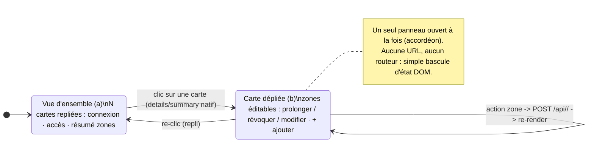
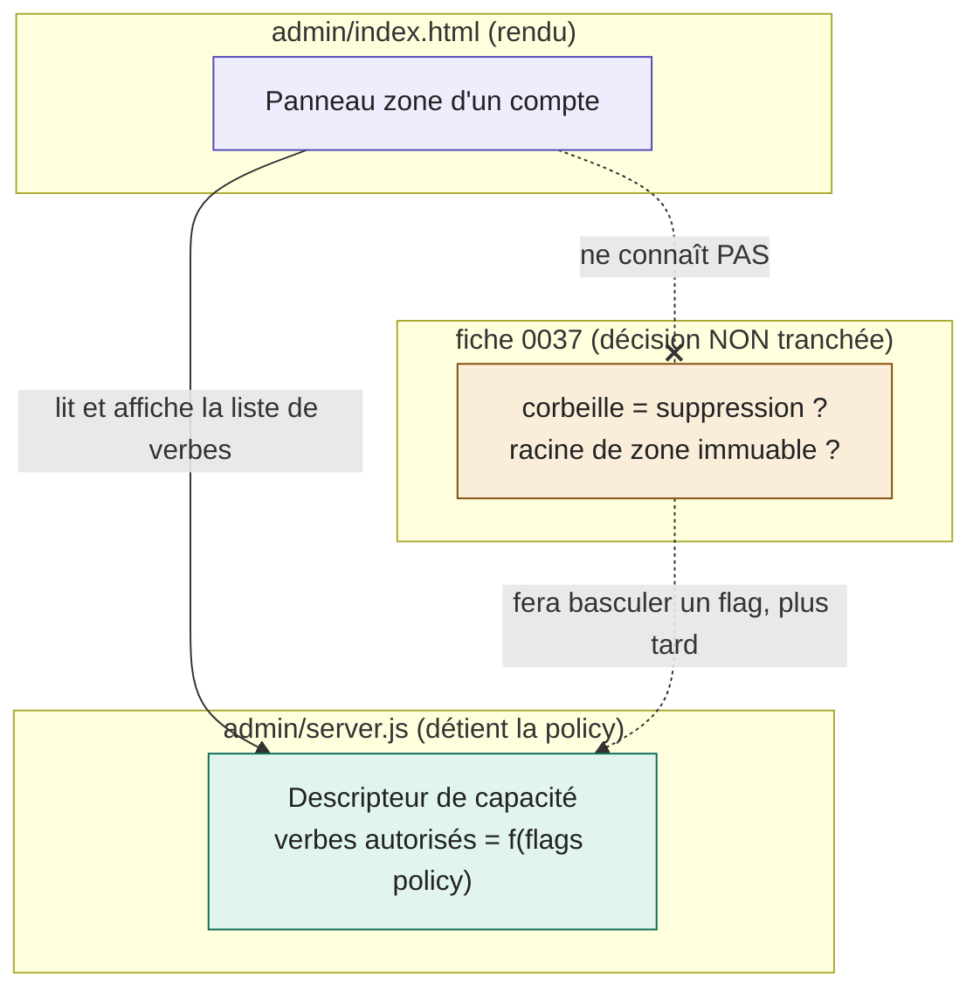

# ADR-0004 — Admin : master-liste à panneau d'expansion, sans vue de détail

Statut : **proposé** (en attente de validation PO) · 2026-07-27 · Portée : `admin/index.html` + `admin/server.js`
Fiches liées : 0036 (clarté des cartes), 0037 (sémantique de la suppression en zone)

## Contexte

L'admin web local est **une seule page** HTML/CSS/JS vanilla (aucun framework,
aucun routeur, aucun build), servie par `admin/server.js` en **Node stdlib pur
(zéro dépendance)**. Les données arrivent en JSON (`GET /api/profiles`), les
actions partent en `POST /api/<alias>/<action>` vers `bin/gwsa`.

On veut passer d'une simple liste de cartes à :
(a) une vue d'**ensemble** (tous les comptes, résumés) ;
(b) un **détail** par compte où les zones d'écriture Drive sont visibles et
**modifiables en ligne** (par zone : prolonger, révoquer, modifier).

Deux formes possibles : master-liste seule avec **expansion in-place**, ou
**master + vue de détail** (qui impose une forme de navigation/routing).

Contrainte transverse : le texte d'avertissement affiché à la pose d'une zone
(« le LLM pourra créer/modifier/corbeiller… ») **dépend d'une décision de policy
non tranchée** (fiche 0037 : corbeille = suppression ? racine de zone immuable ?).
L'UI ne doit pas figer cette décision.

## Décision

**1. Master-liste seule, détail par expansion in-place** via `
/
`
natif — pas de vue de détail séparée, donc **pas de routeur** (ni hash côté
front, ni route HTML côté serveur). La carte repliée EST la vue d'ensemble ; la
carte dépliée EST le détail. Un seul artefact, un seul chemin de rendu.

**2. L'édition des zones vit dans le panneau déplié de la carte.** Chaque zone
est une ligne du panneau portant ses propres actions (prolonger / révoquer /
modifier) ; le résumé replié (`1 temporaire · expire dans 1 h 58`) reste la vue
condensée. Le bouton « ajouter une zone » est en pied de panneau.

**3. L'avertissement de zone est une DONNÉE fournie par le serveur, pas une
chaîne codée dans le front.** `server.js` (qui détient la policy) expose, par
service et par profil, la liste des **verbes effectivement autorisés** (créer,
modifier, corbeiller…) dérivée des flags de policy. Le front **rend** cette
liste ; il n'affirme jamais un verbe en dur.

*Figure 1 — Modèle d'interaction : la vue d'ensemble et le détail sont deux
états de la MÊME carte (repliée / dépliée), reliés par `
` natif ; aucune
navigation ni URL n'est introduite.*

*Figure 2 — Découplage : le front (violet) dépend d'une abstraction, le
descripteur de capacité (vert) ; la décision 0037 (ambre) n'agira que sur un flag
serveur. Trait plein = dépendance assumée ; pointillé = influence future ; croix
= le front n'a aucun lien direct avec 0037. Trancher 0037 ne touchera pas
`index.html`.*

## Options rejetées

- **Master + vue de détail avec routeur hash** (`#/profile/perso`) : impose un
  mini-routeur maison (parse de `location.hash`, swap de vue, gestion du bouton
  retour) + deux chemins de rendu à synchroniser. YAGNI pour 5–20 comptes.
- **Route HTML serveur `/profile/<alias>`** : duplique la mise en page, un
  aller-retour réseau par compte, casse la page unique.
- **Détail en modale `<dialog>`** : dep-free mais enferme sur un compte, empêche
  de balayer/comparer les zones entre comptes ; plus lourd que l'inline.
- **Avertissement codé en dur dans le front** (état actuel de la maquette) :
  couple l'UI à la sémantique 0037 encore ouverte.

## Conséquences

- **+** Zéro dépendance nouvelle ; un seul chemin de rendu ; expansion accessible
  et gratuite (`
` natif, déjà utilisé pour le menu ⋯).
- **+** Passe à l'échelle par le scroll ; **un seul panneau ouvert à la fois**
  garde le DOM petit et l'attention focalisée.
- **+** 0037 pourra être tranchée sans toucher `index.html` : seul le descripteur
  de verbes côté `server.js` change.
- **−** Panneau déplié long sur petit écran → mitigé par l'accordéon (un ouvert)
  et un `scrollIntoView` à l'ouverture.
- **−** Petit ajout backend : exposer les verbes autorisés par service/profil
  dans `/api/profiles` (ou un point dédié). C'est le bon domicile — la policy
  vit côté serveur (DIP).
- À 20+ comptes, prévoir un filtre/recherche en tête de liste (cheap, plus tard) ;
  hors périmètre POC.
