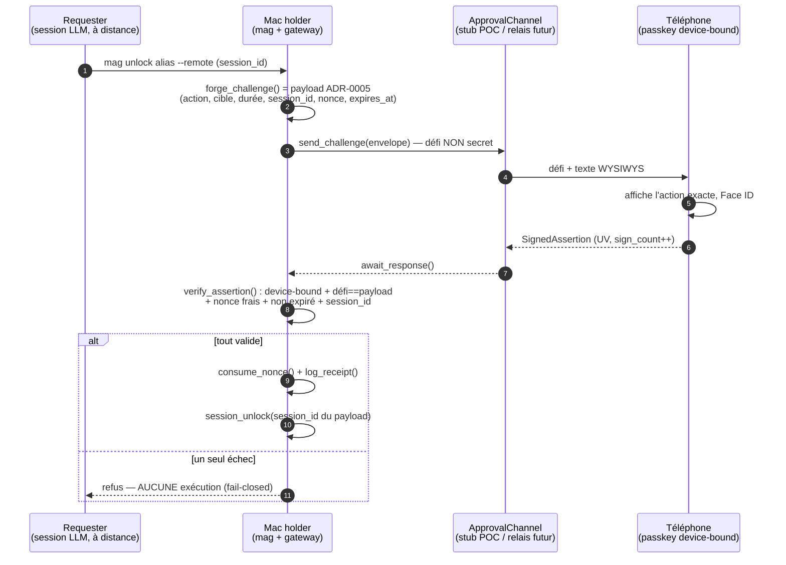
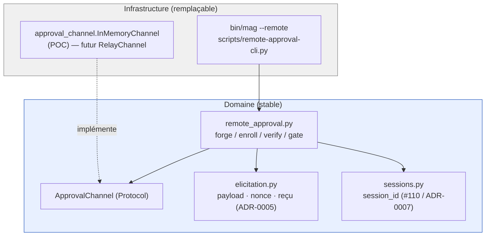

# ADR-0009 — Approbation par passkey depuis le téléphone (POC, Mac holder)

**Date** : 2026-08-16
**Statut** : accepté (POC — fiche 0078, phase 1 de l'épic 0077 / ADR-0008)
**Décideurs** : équipe (étape Archi du sprint)

> **TL;DR** — Quand on pilote une session **loin du Mac**, l'approbation d'un `unlock`/`grant`
> peut être signée par la **passkey du téléphone** au lieu du Touch ID du Mac. On **réutilise
> tel quel** le socle d'élicitation signée (ADR-0005) : même payload canonique décrivant l'action
> (WYSIWYS), même `nonce` anti-rejeu, même reçu, même liaison `session_id` (ADR-0007). Le
> téléphone n'est **qu'un signeur de plus** : il ne détient aucun jeton Google, n'exécute rien.
> Le Mac **forge** le défi, le **transporte** vers le téléphone par une interface de canal
> (stub en mémoire pour le POC), **vérifie** la signature *device-bound* et exécute **seulement**
> si tout est valide — sinon rien (fail-closed). Le Touch ID du Mac reste inchangé.

## Contexte

L'approbation d'une action sensible passe aujourd'hui par le **Touch ID du Mac** : `bin/mag`
construit un payload `{action, alias, email, target, session_id, minutes|hours}`, appelle
`scripts/elicitation-cli.py gate`, et `gateway/elicitation.run_elicitation_gate` **forge** le
payload canonique (ajout `nonce`/`issued_at`/`expires_at`), **obtient une signature**
(`obtain_signature` → Swift Secure Enclave, ou HMAC mock en CI), la **vérifie**
(`verify_signature`), **brûle le nonce** (`consume_nonce`) et **journalise** (`log_receipt`).
La signature est donc **produite localement** — impossible d'approuver depuis un téléphone quand
l'agent tourne ailleurs (Remote Control, Dispatch).

L'ADR-0008 a tranché la direction : séparer *qui demande* / *qui approuve* / *qui détient*, et
migrer le signeur vers une **passkey** (WebAuthn/FIDO2, biométrie). La fiche 0078 en est la
**phase 1, à faible risque** : le Mac **reste le holder** (vault + broker inchangés), seul
l'**approbateur** se déporte sur le téléphone. Contraintes fortes : **fail-closed partout**,
**aucun garde retiré** (Touch ID Mac, policy default-deny, couche session #110 intactes),
**réutiliser** ADR-0005 + sessions (ne pas recoder un mécanisme de signature/nonce parallèle).

## Décision

### 1. La passkey est un **signeur de plus**, pas un mécanisme parallèle

La couture d'extension est le couple **`obtenir une signature` / `vérifier`**. On **conserve
intacte** la colonne vertébrale d'ADR-0005 — payload canonique, `consume_nonce`, `log_receipt` —
et on branche à côté un second signeur. `run_elicitation_gate` (Touch ID) n'est **pas modifié** ;
on ajoute un **frère** `run_remote_approval_gate(fields, channel)` qui partage les mêmes
primitives. Le choix local vs distant se fait **chez l'appelant** (CLI `--remote`), jamais par
défaut : l'approbation distante **ajoute** un chemin, n'en retire aucun.

### 2. Modèle du défi = payload ADR-0005, **lié à la session**

`forge_challenge(fields)` réutilise `elicitation.build_payload()` : le défi **est** le payload
canonique JSON, qui porte déjà `session_id` (ADR-0007), `nonce`, `issued_at`, `expires_at`, et
dont `prompt_from_payload()` dérive le texte **WYSIWYS** (compte, cible, durée) affiché sur le
téléphone. Le défi **n'a pas besoin d'être secret** : la sûreté vient de WYSIWYS + vérification
de signature côté Mac. La passkey signe ce défi comme **challenge WebAuthn** ; la vérification
exige que le `challenge` de l'assertion soit **exactement** le payload canonique forgé — une
autre action ou une autre `session_id` ne peut donc pas être substituée.

### 3. Vérification **device-bound** (refuser une *synced passkey* / un PIN)

- **À l'enrôlement** (`enroll_phone`), on inspecte les flags WebAuthn de l'`authenticatorData` :
  on **refuse** si `BE` (*backup-eligible*) est armé — une passkey *backup-eligible* est
  synchronisable (iCloud / Google Password Manager), donc **pas liée à cet appareil** ; on
  **exige** `UV` (*user-verified*). Le PIN est refusé via une politique d'enrôlement qui exige la
  **vérification biométrique** (dérivée en production de l'`attestation`/`AAGUID` — allowlist
  d'authentificateurs plateforme). On enregistre **la seule clé publique** (COSE/SPKI),
  `credential_id`, `aaguid`, et un `sign_count` initial.
- **À chaque approbation** (`verify_assertion`) : `UV` armé, `BE` non armé, signature valide
  contre la clé publique enrôlée, `sign_count` **strictement croissant** (anti-clonage), défi ==
  payload forgé, `nonce` frais (`consume_nonce`), non expiré. Un seul échec ⇒ **refus total**.

### 4. Le canal derrière une **interface** (stub POC / relais différé)

`ApprovalChannel` (Protocol) = `send_challenge(envelope) -> request_id` +
`await_response(request_id, timeout) -> SignedAssertion | None`. Le domaine dépend de
**l'abstraction**, jamais d'une implémentation (DIP). Le POC fournit **`InMemoryChannel`** (le
signeur de test récupère le défi et répond en process). Le vrai transport — **relais aveugle
chiffré E2E** / push — est une **seconde implémentation** de la même interface, différée à
l'épic 0077.

### 5. Préservation des invariants

Le Mac reste le **holder** : aucun jeton Google ne quitte le Mac, le téléphone ne détient **que**
sa clé privée de passkey (dans son enclave) et **aucun secret Google**. Le Mac ne stocke que la
**clé publique** du téléphone. Touch ID reste le chemin par défaut devant le Mac. Après
vérification, l'action s'exécute avec la `session_id` **issue du payload signé** — jamais celle
« annoncée » par l'appelant — ce qui **interdit le rejeu cross-session**.

### Frontière POC / différé

| Dans le POC (fiche 0078) | Différé (épic 0077) |
|---|---|
| Enrôlement device-bound (refus synced/PIN), clé publique stockée | Vraie app mobile (Tauri 2) |
| Forge du défi (payload ADR-0005 + `session_id`) | Vrai canal push / **relais aveugle E2E** |
| Interface de canal + **stub en mémoire** | Rendu graphique WYSIWYS complet du téléphone |
| Vérification device-bound + anti-rejeu + fail-closed | Parsing CBOR/attestation réel, allowlist AAGUID |
| Simulateur de signeur téléphone (paire de clés de test) | Holder natif mobile (jetons scellés en StrongBox) |

## Schémas

### Flux d'approbation distante

*Légende — Chemin nominal (bleu du haut vers le bas) : le Mac forge un défi lisible, le
téléphone signe ce qu'il voit (WYSIWYS), le Mac vérifie et n'exécute que si tout est valide ; la
branche `else` montre le fail-closed (tout écart ⇒ rien exécuté).*

### Frontières de modules (sens des dépendances)

*Légende — Zone bleue = domaine stable, zone grise = infrastructure remplaçable ; toutes les
flèches pointent **vers le domaine** (le canal concret implémente l'interface `ApprovalChannel`,
le domaine ne connaît jamais le transport concret — DIP).*

## Conséquences

**Devient possible**
- Approuver `unlock`/`grant` depuis le téléphone quand on est loin du Mac, par biométrie.
- Tester tout le chemin **hermétiquement** (simulateur de signeur = paire de clés de test),
  sans vrai téléphone ni compte réel.

**Coûts / points de vigilance**
- Deux signeurs cohabitent (Touch ID local, passkey distante) → garder **une seule** colonne
  anti-rejeu (`consume_nonce` partagé) pour éviter deux politiques de fraîcheur divergentes.
- Le POC modélise l'assertion en JSON WebAuthn-**shaped** (flags + `sign_count` + signature
  P-256 sur `authData || SHA256(clientData)`), **sans** dépendance CBOR : le parsing WebAuthn/
  attestation **réel** est un incrément (épic 0077). La distinction biométrie/PIN est **modélisée**
  au POC (champ d'enrôlement) et sera dérivée de l'attestation en production.
- Anti-clonage : `sign_count` doit être **strictement croissant** et persisté à chaque
  vérification, sinon une passkey clonée passerait.

## Alternatives écartées

- **Modifier `run_elicitation_gate` pour multiplexer les signeurs** — refactor du chemin Touch ID
  éprouvé ⇒ risque de régression sur un garde existant. Écartée : on **ajoute** un frère, on ne
  touche pas à l'existant (invariant « aucun garde retiré »).
- **QR / canal local pour l'approbation** — la fiche exige l'approbation *à distance* (on n'est
  pas devant l'écran) ; le QR reste réservé au **seul** enrôlement.
- **Signer le payload canonique en ECDSA brut (comme `p256:`) côté téléphone** — perd la
  structure WebAuthn (flags `UV`/`BE`, `sign_count`, `clientDataJSON`) qui **porte** la garantie
  device-bound et l'anti-clonage. Écartée : on veut une assertion WebAuthn-shaped dès le POC.
- **Vrai relais aveugle E2E dès le POC** — non nécessaire pour valider forge/vérif/fail-closed ;
  le défi n'a pas besoin d'être secret. Différé (YAGNI) derrière l'interface `ApprovalChannel`.
- **Le téléphone devient holder / détient des jetons** — c'est l'ADR-0008 cible, hors phase 1 :
  refonte native, écartée du POC.

## Références

- [ADR-0005](ADR-0005-elicitation-signee-v2.md) — élicitation signée (payload + nonce + reçu, réutilisés).
- [ADR-0007](ADR-0007-droits-par-session.md) — droits par session (`session_id`, couche #110).
- [ADR-0008](ADR-0008-acces-mobile-passkey-holder-natif.md) — direction mobile ; cette fiche = phase 1.
- Fiche `features/done/0078-approbation-passkey-archi-actuelle.md` (7 critères d'acceptation).
- Code : `gateway/elicitation.py`, `gateway/sessions.py`, `scripts/elicitation-cli.py`, `bin/mag`.
