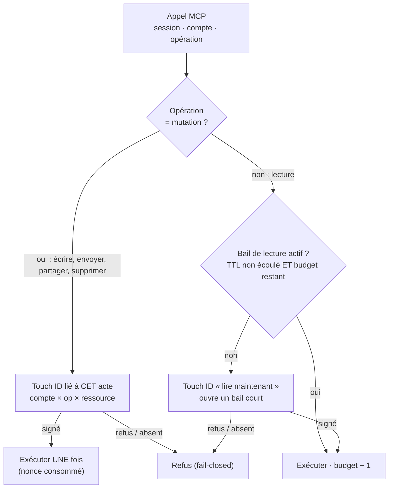
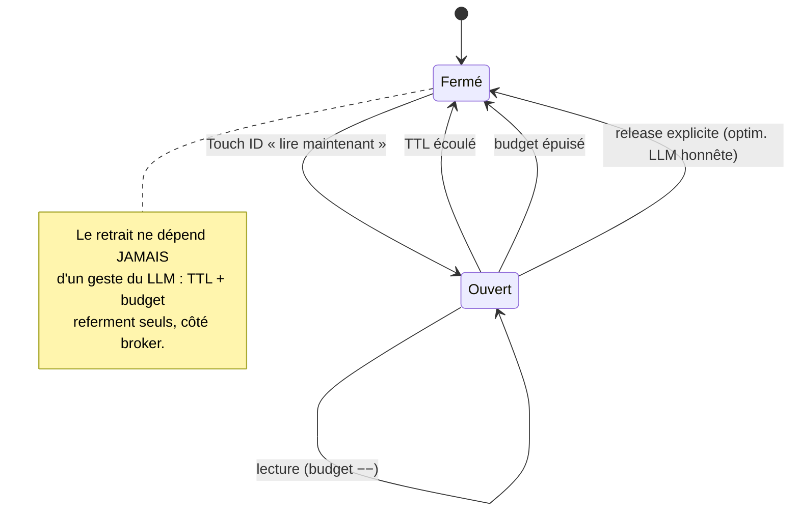

# ADR-0011 — Durée du consentement : bail de lecture court + acte sensible signé, la fenêtre de minutes retirée (fiche 20260911135931576)

**Date** : 2026-09-11
**Statut** : proposé (grain : modèle de durée ; s'applique à `session_unlock` comme au mode in-conversation)
**Décideurs** : Thomas (mainteneur), architecte (cette décision)

> **En clair** — Un Touch ID n'ouvre plus une porte pour 60 minutes. Pour **lire**, il ouvre un **bail court** (quelques requêtes, quelques dizaines de secondes) qui se **referme tout seul**. Pour **écrire, envoyer ou partager**, il n'ouvre **rien du tout** : chaque acte sensible exige **son propre** Touch ID, lié à cet acte exact. La fenêtre de minutes disparaît comme mécanisme central. *L'outil vérifie, l'humain autorise chaque effet visible, le LLM propose.*

## Contexte

Le déverrouillage par session ([ADR-0007](ADR-0007-droits-par-session.md), fiche `0076` livrée) prend un paramètre **`minutes`** (défaut 60, borné 1–1440). Un Touch ID, puis la session accède **librement** au compte jusqu'à expiration, **sans re-validation** (`gateway/sessions.py:296` `session_unlock` → `unlocks[alias] = now + minutes*60` ; `gateway/api.py:118` `_run` n'exige rien d'autre que `is_session_unlocked`). Le mode « élicitation dans la conversation » reprend ce même paramètre.

Deux reproches, tranchés par Thomas :

- **La durée est arbitraire.** L'usage conversationnel est « je demande une chose, elle se fait, c'est fini » — pas « garde la porte ouverte une heure ».
- **La fenêtre est une fenêtre d'abus.** Pendant N minutes, un LLM détourné (injection de prompt) enchaîne des opérations dans **tous** les droits de la session, **sans** nouveau geste humain. Le rayon d'explosion d'une injection = tout ce que la policy compte autorise, pendant N minutes.

Contraintes structurantes :

- **Le serveur MCP ne sait pas quand le LLM a fini de répondre.** Le protocole ne porte pas la frontière « une réponse ». On ne peut donc pas s'appuyer sur le LLM pour refermer proprement — un LLM détourné ne coopérera pas.
- Le mécanisme de consentement existe déjà et lie **cryptographiquement** le geste à l'action exacte : `run_elicitation_gate` (`gateway/elicitation.py:501`) signe un payload `action × alias × target × resource × nonce` (anti-rejeu, ADR-0005). On réutilise, on n'invente pas.
- ADR-0007 pose déjà l'asymétrie **lecture / écriture** : la ressource est **exigée en écriture** (Drive), optionnelle en lecture. La durée doit épouser la même asymétrie.

## Décision

**Deux régimes de durée, selon que l'opération est une lecture ou une mutation. Le mapping tool → (opération, lecture|mutation) est fixé à l'implémentation, comme le mapping tool → (opération, ressource) d'ADR-0007.**

1. **Mutation (écriture, envoi, partage, suppression) = acte signé à usage unique.** Aucune fenêtre. Chaque acte sensible exige **son** Touch ID, lié au scope exact (compte × opération × ressource : le dossier écrit, le fichier partagé, le destinataire). Le reçu signé autorise **exactement une** exécution ; le nonce consommé = l'acte consommé (`consume_nonce`, déjà en place). Un second acte, même identique, redemande un Touch ID. C'est le modèle « paiement par carte » : on valide **au moment d'agir**.

2. **Lecture = bail court, auto-refermé.** Un Touch ID « lire maintenant » ouvre un **bail** sur (session, compte, lecture) borné par **deux limites, la première atteinte referme** : un **TTL court** (défaut ~90 s) **ET** un **budget d'opérations** (défaut ~20 lectures). Le bail couvre l'enchaînement naturel d'une même demande (lister → ouvrir → ouvrir…) sans re-valider à chaque objet, mais se referme bien avant de devenir une fenêtre d'abus.

3. **Le retrait ne dépend JAMAIS d'un geste du LLM.** La fermeture est **automatique** (TTL écoulé ou budget épuisé), calculée côté broker à chaque appel. Un tool de release explicite (`session_close` / fin de bail) reste **possible en option** — pour raccourcir le bail quand le LLM est honnête — mais c'est une **optimisation**, jamais la frontière de sécurité. Un LLM détourné qui ne le rappelle pas ne gagne rien : le bail se referme seul.

4. **`minutes` retiré comme mécanisme central.** `session_unlock` et le mode in-conversation n'ouvrent plus une fenêtre longue : ils ouvrent le **bail de lecture** court. Le paramètre `minutes` est **déprécié** : conservé en entrée pour compat, mais **écrêté au plafond du bail** (quelques minutes max, plus 1440) — un ancien appelant voit sa fenêtre d'abus bornée immédiatement, sans casser l'API. À terme, retrait sec.

5. **Les droits (le *quoi*) restent définis par la policy / l'admin / le manifeste projet** (intersection *fail-closed*, ADR-0007 §Décision 3). Cette ADR ne change **que la temporalité** du consentement (le *combien de temps*), pas le périmètre (fiche `0108`) ni qui déclenche le popup (fiche in-conversation).

### Le point de contrôle unique — `_run`

*Légende — le losange du haut sépare les deux régimes : une mutation passe toujours par un Touch ID dédié à l'acte (branche gauche, usage unique) ; une lecture réutilise le bail court tant qu'il tient, sinon en rouvre un (branche droite). Tout refus ou geste absent tombe sur le refus fail-closed.*

### Cycle de vie du bail de lecture

*Légende — le bail se referme par l'une des trois voies ; seules les deux premières (TTL, budget) sont des garanties de sécurité, la troisième (release) n'est qu'un raccourci quand le LLM coopère.*

## Anti-injection — ce que le transactionnel réduit vraiment (noir sur blanc)

- **Fenêtre de minutes (avant).** Un seul Touch ID → un LLM détourné enchaîne, pendant N minutes, **toute** opération que la policy compte permet — lectures **et** mutations, sans autre geste. Rayon d'explosion : large et durable.
- **Bail de lecture (après).** Une injection qui atterrit pendant un bail ne peut faire que des **lectures**, seulement pendant un TTL court **et** dans un budget limité, et le bail **se referme seul** — le LLM ne peut pas le prolonger. Le geste humain signifiait « lis maintenant », pas « lis pendant une heure ».
- **Acte sensible signé (après).** C'est le vrai gain. Tout effet **visible de l'extérieur** — envoyer, partager, écraser, supprimer — exige un Touch ID **lié à cet acte précis** (ce destinataire, ce dossier, ce fichier). Une injection ne peut provoquer **aucun** effet externe sans que l'humain approuve **physiquement cet acte-là**. On passe de « à l'intérieur d'une fenêtre de confiance » à « chaque effet est porté ».
- **Limite honnête, inchangée.** Sans vault (fiche `0003`), le modèle reste **coopératif** : un agent avec shell peut éditer `.sessions/` ou appeler `gws` nu. Le transactionnel **durcit** le modèle coopératif (réduit la surface temporelle et impose un geste par effet) ; il ne le rend pas cryptographiquement étanche.

## Options considérées

**Comment borner « la demande en cours »**

| Option | Simplicité | Dépend du LLM ? | Borne l'abus | Verdict |
|---|---|---|---|---|
| **Bail court : TTL ET budget d'ops, auto-refermé** | moyenne | non | temps **et** volume | **retenu** |
| TTL court seul | forte | non | temps seulement (rafale possible) | rejeté — un burst épuise le TTL |
| Compteur d'opérations seul | forte | non | volume seulement (bail « dormant » longtemps) | rejeté — pas de borne temporelle |
| Release explicite (`session_close`) comme frontière | forte | **oui** | nulle si LLM détourné | rejeté comme frontière — **gardé en option** d'optimisation |

**Régime lecture vs écriture** : *deux régimes* (**retenu** — lecture = bail, mutation = acte signé ; épouse l'asymétrie ressource d'ADR-0007) vs *un seul régime* (rejeté — soit fatigue de validation sur les lectures, soit fenêtre d'abus sur les écritures).

**Sort de `minutes`** : *déprécié + écrêté au plafond du bail* (**retenu** — borne l'abus sans casser l'API) vs *retrait sec immédiat* (rejeté pour ce jalon — casse `session_unlock`, l'admin, les tests d'un coup) vs *garder tel quel en override* (rejeté — réintroduit la fenêtre d'abus).

## Conséquences

**Plus facile** : le geste humain colle à l'intention (« agis maintenant ») ; le rayon d'explosion d'une injection s'effondre (temps + volume bornés, chaque effet externe porté) ; l'audit devient lisible (un reçu signé **par acte** sensible, pas un unique reçu qui couvre une heure d'activité).

**Plus dur** : plus de Touch ID au total (assumé — c'est le prix d'« un geste par effet ») ; il faut un **mapping tool → lecture|mutation** net et fail-closed (un tool non classé = traité en mutation, le plus strict) ; le bail ajoute un peu d'état au registre de session (TTL + compteur par (session, compte)) ; le curseur des défauts (~90 s / ~20 ops) devra être **calibré à l'usage** pour ne pas banaliser le geste.

**À revisiter** : les défauts numériques (TTL, budget) après usage réel ; l'opportunité d'ajouter le tool de release ; une **allowlist de comptes sensibles** où même la lecture passe en acte signé (à croiser avec le 2ᵉ temps de la fiche in-conversation) ; le retrait **sec** de `minutes` une fois les appelants migrés.

## Repli (fail-closed) & limites

- Touch ID refusé, biométrie indisponible, jeton absent/expiré → **refus** (jamais d'accès par défaut) — inchangé vs ADR-0007.
- **Tool non classé** lecture|mutation → traité en **mutation** (acte signé) : le régime le plus strict par défaut.
- Bail expiré (TTL) ou budget épuisé **pendant** une demande → la lecture suivante **rouvre** un bail (nouveau Touch ID) ; aucun accès silencieux au-delà.
- Le tool de release, s'il est ajouté, **ne peut jamais** étendre un droit — seulement refermer plus tôt. Un LLM qui ne l'appelle pas ne gagne aucun accès.

## Références

- Fiches (dans le dépôt) : `features/20260911135931576_deverrouillage-transactionnel-vs-minutes.md` (celle-ci), `features/20260910194019668_elicitation-in-conversation-opt-in.md`, `features/0108-session-demande-sous-ensemble-droits-compte.md`, `features/0082-droits-par-session.md`, `features/0003-vault-credentials-hors-perimetre-agent.md`
- ADR : [ADR-0007](ADR-0007-droits-par-session.md) (socle droits par session), [ADR-0005](ADR-0005-elicitation-signee-v2.md) (élicitation signée réutilisée)
- Code : `gateway/sessions.py` (`session_unlock:296`, `is_session_unlocked:454`, `SessionState:74`), `gateway/api.py` (`_run:88`, gate verrou `:118`, `access_request:895`, `session_unlock_in_conversation:1121`), `gateway/elicitation.py` (`run_elicitation_gate:501`, `consume_nonce:229`, `build_payload:177`)
- Menace : `docs/threat-model.md`, `SECURITY.md`
