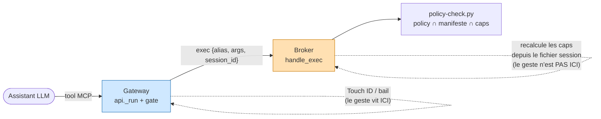
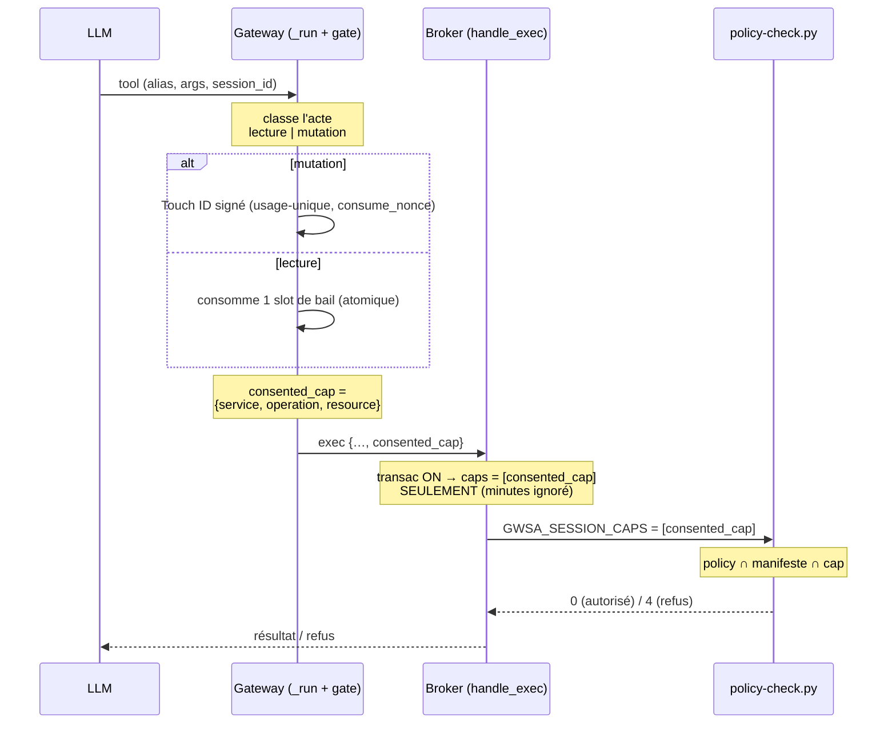
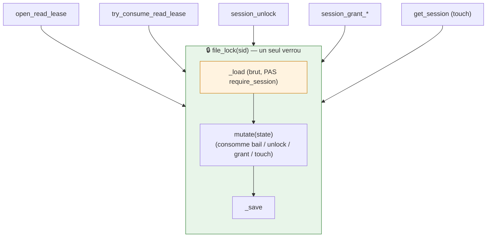

# ADR-0012 — Consentement transactionnel : propager le geste jusqu'à la policy (raffinement d'ADR-0011)

**Date** : 2026-09-12
**Statut** : proposé (raffine ADR-0011 sur 3 points d'implémentation ; feature opt-in, OFF par défaut)
**Décideurs** : Thomas (mainteneur)
**Raffine** : [ADR-0011](ADR-0011-consentement-transactionnel.md) · s'appuie sur [ADR-0007](ADR-0007-droits-par-session.md), [ADR-0005](ADR-0005-elicitation-signee-v2.md)

> **TL;DR** — ADR-0011 a posé le *quoi* du consentement transactionnel (bail de lecture, acte de mutation signé usage-unique, retrait jamais LLM-dépendant). Trois rondes de revue Codex ont montré que le *comment* fuyait par trois trous : le geste réussissait dans la **gateway** mais le **broker** refusait quand même (il recalculait des capacités vides), des écritures de session concurrentes s'écrasaient, et la signature ne liait pas les vrais arguments de l'acte. Cet ADR tranche les trois **en amont** pour qu'une seule implémentation propre remplace les rustines : (1) la capacité consentie **voyage dans l'appel** et devient la source unique côté broker ; (2) **tous** les read-modify-write de session passent par **un seul verrou** ; (3) les arguments conséquents entrent dans le **payload signé** via une **table explicite**, acte non mappé = refus. *L'outil vérifie, l'humain autorise, le LLM propose.*

---

## Contexte

Le geste et l'application du droit vivent dans **deux process** qui ne se parlent que par une socket JSON :

*Figure 1 — Le geste réussit en bleu (gateway), mais la décision d'accès se prend en orange (broker) à partir du fichier de session, que le geste n'a pas mis à jour. D'où le trou : consentement obtenu, accès refusé.*

Concrètement, les trois findings P1 récurrents de Codex (PR #147) :

1. **Le consentement n'atteint pas la policy.** `_require_access` (broker) n'exige plus `is_session_unlocked` en mode transactionnel, mais `handle_exec` calcule toujours les caps depuis `is_session_unlocked`/`active_capabilities` → il envoie un `GWSA_SESSION_CAPS` **vide** à `policy-check.py`, qui refuse alors **toute** opération (deny-all sur ensemble vide, ADR-0007 §3). Un profil à `policy.json` reste bloqué même après un Touch ID transactionnel réussi.
2. **Les écritures de session se clobberent.** Un verrou par session protège `try_consume_read_lease` et le touch de `get_session`, mais `open_read_lease`, `session_unlock`, `session_grant_*` chargent via `require_session` puis sauvent **hors verrou** → un save concurrent restaure un budget de bail obsolète.
3. **La signature ne lie pas l'acte réel.** Le payload signe `service:ressources:méthode` + une ressource unique. Deux `drive permissions create` sur le même fichier (destinataire/rôle différents) signent pareil ; une suppression de permission omet `permissionId` ; un brouillon Gmail omet destinataire/sujet. L'humain approuve sans voir la conséquence.

**Choix : nouvel ADR plutôt qu'amendement d'ADR-0011.** ADR-0011 est *accepté* et vit sur une autre branche non mergée. Ces trois points sont des **décisions neuves, avec alternatives**, nées de la revue — les tracer à part préserve le fil « pourquoi l'implémentation propre a cette forme » et évite un conflit inter-branches. ADR-0012 raffine, ne remplace pas.

---

## Décision — Zone 1 : la capacité consentie voyage dans l'appel

**Décision.** Après un geste réussi, la gateway calcule la capacité **exacte** de l'acte — `{service, operation, resource}` — et l'attache à la requête exec du broker (nouveau champ `consented_cap`). En mode transactionnel, le broker n'utilise **que** cette capacité comme caps de session (`session_full_access` forcé à `False`, `active_capabilities`/unlock-minutes ignorés) et la passe à `policy-check.py`. L'intersection ADR-0007 s'applique donc **inchangée** : `policy compte ∩ manifeste projet ∩ {consented_cap}`. La capacité n'est **jamais persistée** ; elle est **usage-unique par construction** (elle vit le temps d'un appel).

*Figure 2 — Le geste (bleu, gateway) produit une capacité qui descend dans l'appel jusqu'à la policy (orange, broker). Pas de `consented_cap` → caps vides → refus. La capacité ne peut jamais dépasser policy ni manifeste : le geste ouvre au plus l'acte demandé, borné par l'intersection ADR-0007.*

**Alternatives rejetées.**
- *Persister une `Capability` éphémère usage-unique dans le fichier session*, que `active_capabilities` relit. Rejeté : réintroduit une **fenêtre** (la cap doit survivre à l'aller-retour socket → un 2ᵉ acte identique la retrouverait active), ajoute un **état de mutation persistant** + un *consume-after-use* (crash entre octroi et consommation = cap pendante), et crée une **double comptabilité** avec le bail déjà persisté.
- *Re-vérifier la signature/nonce dans le broker.* Rejeté : le nonce est déjà consommé en amont (ADR-0005), re-vérifier ECDSA sur le chemin chaud est redondant et sans gain dans le modèle coopératif loopback+token.

**Conséquences.** Le point de contrôle redevient **unique** : la gateway décide, le broker applique la même décision, plus de recalcul divergent. Le protocole socket gagne un champ. La mécanique minutes est totalement court-circuitée en mode transactionnel (conforme « transactionnel *remplace* minutes »).

**Repli fail-closed.** Champ absent/illisible → caps vides → **deny-all** (comportement ADR-0007 §3 inchangé). Le broker n'est joignable que via la gateway (loopback + token), qui a déjà porté le geste ; il ne fabrique jamais de cap lui-même.

**Honnêteté du modèle.** Le broker fait confiance à l'assertion de la gateway — c'est **déjà** la posture d'ADR-0007 (sans vault, un shell nu contourne). Durcissement possible (lot 5, hors POC) : la gateway joint l'**id de reçu/nonce**, le broker **confirme la consommation** avant d'honorer la cap → la cap est alors liée à la preuve signée, pas à un simple champ.

---

## Décision — Zone 2 : un seul verrou pour tous les RMW de session

**Décision.** Tous les read-modify-write d'un même fichier de session passent par **un unique verrou par session** (`_lock_path(sid)`), via un helper privé `_with_locked_session(sid, mutate)` qui **charge en brut** (`_load`), applique la mutation, `touch()` puis `_save` — **le tout sous le verrou**. Les fonctions internes n'appellent **jamais** `require_session`/`get_session` sous le verrou : `file_lock` est un `flock` **non réentrant** (une 2ᵉ prise dans le même process **bloque**). Routent par le helper : `get_session` (touch), `open_read_lease`, `session_unlock`, `session_grant_drive`, `session_grant_capability`, `try_consume_read_lease`.

*Figure 3 — Toutes les entrées d'écriture de session convergent vers le même verrou (vert). À l'intérieur, on charge en brut (orange) — jamais `require_session`, qui reprendrait le verrou et deadlockerait. Un save concurrent ne peut plus restaurer un budget obsolète.*

**Alternative rejetée.** *Isoler l'état volatil du bail dans un fichier `<sid>.lease.json` séparé, avec son propre verrou.* Séduisant pour le chemin chaud (le bail ne contend plus avec grant/unlock), mais : deux fichiers, deux verrous, **source de vérité éclatée**, cohérence TTL croisée (l'expiration de session doit aussi nettoyer le bail). Sur-ingénierie pour un POC (**YAGNI**). Le surcoût du verrou unique = **une acquisition flock non contendue par appel** — négligeable devant l'exec `gws` (socket + subprocess).

**Conséquences.** Sérialisation stricte des mutations de session, un seul mécanisme à raisonner et à tester. Le chemin chaud (lecture) paie une acquisition de plus, sans contention réelle.

**Repli fail-closed.** Échec ou timeout d'acquisition du verrou → **refus**, jamais un RMW non sérialisé.

---

## Décision — Zone 3 : lier les arguments conséquents au payload signé

**Décision.** Une **table explicite** `(service, méthode) → arguments conséquents` (modelée sur le mapping tool→ressource `_OPERAND_PARAM` d'ADR-0007/`categorize.py`) extrait, à partir des **mêmes flags parsés** (`parse_json_flag`), un ensemble d'arguments **normalisés et canoniques** (clés triées, listes ordonnées). Ces arguments entrent dans un objet `bound_args` du **payload signé** (ADR-0005) **et** dans le prompt Touch ID (Python `prompt_from_payload` **et** Swift `promptText`). **Acte mutant non mappé → refus** : on ne signe ni n'affiche ce qu'on ne sait pas décrire.

Table initiale (surface de mutation réellement exposée par les tools MCP) :

| Service · acte | `bound_args` signés & affichés |
|---|---|
| `drive permissions create` | `fileId`, `type`, `role`, `grantee` (email/domaine) |
| `drive permissions delete` | `fileId`, `permissionId` |
| `drive files delete` / trash | `fileId` |
| `drive files update` | `fileId`, champs modifiés |
| `gmail drafts create` | `to[]` (triés), `cc[]`, `subject` |
| *tout autre acte mutant* | **∅ → refus (fail-closed)** |

*Lecture : le bail reste volontairement grossier (TTL + budget), donc **pas** de `bound_args` en lecture — seules les mutations lient leurs arguments.*

**Alternatives rejetées.**
- *Empaqueter role/grantee dans la chaîne `target` existante* (zéro changement de schéma). Rejeté : **injection de délimiteur** — un `fileId`/email contenant le séparateur forge ou rend ambigu le payload ; rendu illisible. L'objet structuré canonicalisé est **injection-safe**.
- *Heuristique « prendre tous les `--flags` »*. Rejeté : **surface attaquable**, non déterministe, prompt illisible. Comme ADR-0007, on veut un **mapping explicite**, jamais une devinette.

**Conséquences.** Le reçu et le dialogue Touch ID disent **qui** reçoit **quoi** et à **quel rôle** : l'humain approuve la conséquence réelle. Le payload canonique d'ADR-0005 gagne un champ `bound_args` — **bump de contenu à répliquer côté signeur Swift** : les octets canoniques (clés triées) doivent être **identiques** Python/Swift.

**Repli fail-closed.** `consequential_args()` renvoie `None` (acte hors table) → la gate **refuse**. Ressource/argument attendu absent ou ambigu → refus (jamais un acte signé « à blanc »).

---

## Plan d'implémentation (par lots)

Ordre choisi : assainir la base (verrou) **avant** d'y brancher la propagation, la signature en dernier car elle seule touche Swift.

| Lot | Contenu | Testable comment |
|---|---|---|
| **1 — Zone 2** | `_with_locked_session` + routage de **tous** les RMW ; supprime les save hors verrou. Refactor interne pur. | **Hermétique.** Tests de concurrence (course consume ↔ save), non-régression flag OFF. |
| **2 — Zone 1** | Champ `consented_cap` gateway→broker ; broker : en transac ON, `caps = [consented_cap]` **seulement** ; `policy-check.py` inchangé. | **Hermétique.** Transac ON + `policy.json` restrictive + `GWSA_ELICITATION_MOCK=1` : acte consenti passe, acte non consenti = deny. Sans Touch ID réel. |
| **3 — Zone 3 (Python)** | Table `consequential_args` + `bound_args` dans le payload + rendu prompt Python. | **Hermétique.** Test *octets canoniques* via chemin mock HMAC ; acte non mappé → refus. |
| **4 — Zone 3 (Swift) + live** | Rendu prompt Swift + **parité des octets canoniques** Python/Swift ; dialogue Touch ID affichant op + compte + args ; test 2 conversations. | **Non hermétique** — exige le vrai broker + Swift + Touch ID (test manuel `tests/manuels/`). |
| **5 — Durcissement (optionnel, hors POC)** | Broker re-lie la cap au reçu signé (confirme le nonce consommé) avant d'honorer `consented_cap`. | Hermétique côté nonce ; décision de posture (cf. ci-dessous). |

**Invariants préservés à chaque lot** : opt-in OFF par défaut (flag `.transactional-consent` / `GWSA_TRANSACTIONAL_CONSENT`) ; jamais de restauration de la fenêtre minutes ; réutilisation de `consume_nonce`, `categorize`, `parse_json_flag`, du mapping ADR-0007.

---

## Ce qui reste une décision **humaine** (valeur, pas technique)

1. **Réglages par défaut du bail** (aujourd'hui TTL 90 s / budget 20 opérations) — curseur produit friction ⇄ sûreté. À valider par Thomas.
2. **Périmètre `bound_args` pour Gmail** : signer le **corps** du brouillon (ou son hash) ou seulement `to`/`cc`/`subject` ? Proposition : `to`/`cc`/`subject` (aucun tool n'*envoie* ; le corps est volumineux et volatil). Arbitrage fidélité ⇄ ergonomie.
3. **Faire le lot 5 dans ce POC ?** Lier la cap au reçu signé côté broker, ou assumer le modèle coopératif (loopback + token) comme le reste d'ADR-0007. **Décision de posture de sécurité**, pas d'implémentation.

---

## Références

- ADR : [ADR-0011](ADR-0011-consentement-transactionnel.md) (modèle transactionnel — raffiné ici), [ADR-0007](ADR-0007-droits-par-session.md) (intersection fail-closed policy ∩ manifeste ∩ caps), [ADR-0005](ADR-0005-elicitation-signee-v2.md) (payload signé, `consume_nonce`).
- Fiche : `features/20260911135931576_consentement-transactionnel.md` (à créer/mettre à jour si absente).
- Code : `gateway/api.py` (`_run`, `_transactional_gate`, `_classify_operation`), `gateway/broker_server.py` (`handle_exec`, `_require_access`, `check_policy`), `gateway/sessions.py` (verrou, bail), `gateway/categorize.py` (`operand_resource`, `_OPERAND_PARAM` — modèle de la table zone 3), `scripts/policy-check.py` (`check_session_caps`, `_session_cap_allows`), `scripts/elicitation-sign.swift` (`promptText`), `gateway/elicitation.py` (`prompt_from_payload`, `run_elicitation_gate`).
- Menace : `docs/threat-model.md`, `SECURITY.md`.
