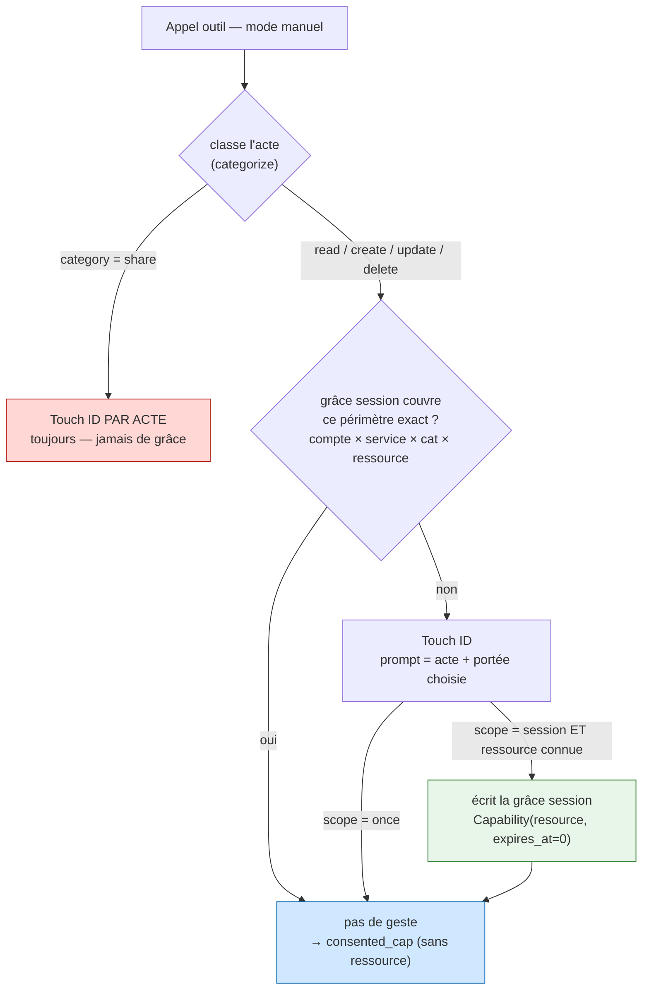
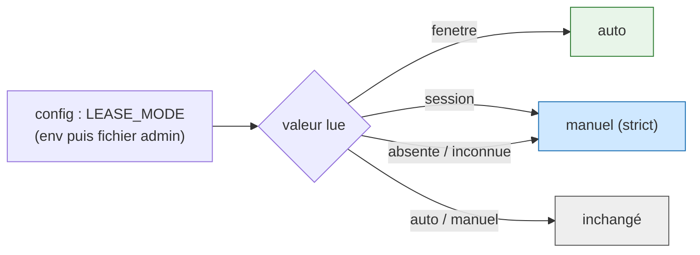

# ADR-0013 — Consentement « une fois / pour la session » : la portée devient un choix par acte (raffinement d'ADR-0012 Zone 4)

**Date** : 2026-09-20
**Statut** : proposé (raffine ADR-0012 Zone 4 ; feature opt-in, OFF par défaut)
**Décideurs** : Thomas (mainteneur)
**Raffine** : [ADR-0012](ADR-0012-consentement-transactionnel-propagation.md) · s'appuie sur [ADR-0011](ADR-0011-consentement-transactionnel-par-session.md), [ADR-0007](ADR-0007-droits-par-session.md), [ADR-0005](ADR-0005-elicitation-signee-v2.md)

> **En clair** — Le consentement transactionnel marche (livré #149), mais il manque le geste de Claude Code : au moment d'autoriser, dire « une fois » ou « pour toute la session ». Cet ADR l'ajoute **sans nouvelle mécanique** : la grâce « session » réutilise les capacités de session existantes avec une **borne de temps nulle** (convention déjà en place pour le bail de lecture), elle est **scopée au dossier exact**, **résolue côté gateway** (le broker ne bouge pas), et le **partage n'y est jamais éligible**. Les trois modes de durée d'ADR-0012 deviennent **deux modes** — `manuel` (défaut) et `auto` (ex-`fenetre`) —, le mode global `session` disparaît, et les durées (TTL de session, fenêtre auto) deviennent des réglages admin. *L'outil vérifie, l'humain autorise, le LLM propose.*

---

## Contexte

Le test manuel de #149 (gma-tx, vrais comptes) a validé le cœur transactionnel : refus sans session, double consentement (chat + Touch ID), lecture et écriture signées par acte. Il a révélé un manque et deux scories :

1. **Pas de « pour la session ».** En `manuel`, répéter exactement le même acte (écrire dans le même dossier) redemande un Touch ID à chaque fois. Il manque « accepte ce périmètre pour le reste de la session », le choix par acte de Claude Code.
2. **Durées non voulues.** Le déverrouillage `unlock` arme encore les écritures par une fenêtre de minutes, alors que le modèle transactionnel n'en veut pas.
3. **Mode non réglable depuis l'admin.** Le mode se choisit par env/fichier ; il faut un sélecteur, comme le menu de modes de Claude Code.

ADR-0012 Zone 4 avait posé trois modes de durée du bail (`manuel`/`fenetre`/`session`). Le test montre que le bon curseur n'est pas *la durée du bail* mais *la portée d'un consentement*, choisie **acte par acte**. Cet ADR remplace donc la Zone 4.

*Figure 1 — Le chemin de décision en mode `manuel`. Rouge : le partage est toujours signé par acte, jamais couvert par une grâce. Bleu : l'appel est autorisé pour ce seul appel (cap sans ressource, comme aujourd'hui). Vert : une grâce scopée au dossier est écrite dans la session ; un acte du même périmètre repassera par la branche « oui » sans geste.*

---

## Décision 1 — La grâce « session » réutilise les capacités, avec une borne de temps nulle

**Décision.** « Pour la session » écrit une `Capability(account, service, operation, resource, expires_at=0.0)` dans la liste `capabilities` de la session. La valeur **`expires_at <= 0` encode « pas de borne de temps propre »** : la grâce vit tant que le fichier de session existe, et disparaît avec lui (TTL d'inactivité ou `close_session`). C'est la **même convention sentinelle que `ReadLease`** — une seule idée à retenir dans tout le module. `Capability.active()` devient `expires_at <= 0.0 or expires_at > t` (miroir de `ReadLease.active`).

**Alternative rejetée.** Une collection `session_grants` séparée, avec son verrou. Séduisant pour isoler, mais : source de vérité éclatée, duplication de l'héritage parent→enfant (`_effective_capabilities`, `create_child_session`), du rendu `list_sessions`, et cohérence TTL croisée. Sur-ingénierie pour un POC (YAGNI) — même raisonnement que l'alternative « deux fichiers » écartée en ADR-0012 Zone 2.

**Conséquences.** Zéro nouvelle structure ; l'héritage sous-session, le snapshot et la purge fonctionnent déjà. `list_sessions` doit afficher « vit avec la session » pour un cap sentinelle (pas un `minutes_left` négatif). Le grant public `session_grant_capability` (piloté par l'humain, à TTL) reste inchangé : seul le chemin transactionnel produit la sentinelle.

**Repli fail-closed.** Cap illisible/absente → non couverte → geste redemandé. La grâce ne survit jamais à son fichier de session.

---

## Décision 2 — Périmètre = la ressource exacte (le dossier), côté grâce seulement

**Décision.** La grâce est scopée au quadruplet `(compte=alias, service, opération=catégorie, ressource)`, où `ressource` est l'opérande réel dérivé par `operand_resource()` (déjà la source de vérité de l'autorisation Drive) : `parents` de destination pour `create`, `fileId` pour `update`/`delete`. Le matching réutilise **`session_has_capability()` sans modification** — une cap à ressource ne couvre que cette ressource, une cap sans ressource couvre tout le service×opération.

**Point structurant.** La ressource vit **dans la grâce stockée** (pour le matching gateway), **pas dans le `consented_cap`** qui descend au broker : ce dernier reste **sans ressource**, comme depuis ADR-0012 Zone 1. Le scoping est appliqué en amont ; le broker garde `policy ∩ manifeste ∩ cap` intact.

**Alternative rejetée.** Mettre la ressource dans le `consented_cap` qui voyage. Rejetée : rouvre le trou Codex #147 P1 (cap scopée qui ne matche aucun chemin policy-check → re-deny), fermé à dessein par ADR-0012.

**Conséquences.** « Une fois » ne stocke rien (Touch ID par acte, comme aujourd'hui) ; seul « pour la session » écrit une grâce. Un `create` scope le **dossier de destination** (démo de la fiche) ; un `update`/`delete` scope le **fichier précis** (plus granulaire, plus sûr).

**Repli fail-closed.** Écriture sans ressource dérivable (`operand_resource == ""`, ambigu) → grâce non écrite, « session » retombe sur « une fois ». Jamais de grâce d'écriture à l'échelle du service.

---

## Décision 3 — Résolution côté gateway ; le broker ne change pas

**Décision.** En mode `manuel`, `_transactional_gate` (gateway) résout la grâce avant tout geste : (1) classer, (2) garde-fou partage, (3) `session_has_capability(...)` → si couvert, aucun Touch ID, retourner `_consented_cap(service, category)` sans ressource, (4) sinon Touch ID puis, au succès et si portée=session et éligible, écrire la grâce. Le broker reçoit toujours un `consented_cap` sans ressource : `handle_exec` est **inchangé**.

Le choix « une fois / pour la session » est un **champ de portée signé** (`grant_scope ∈ {once, session}`, défaut `once`), threadé au niveau de l'appel à travers `_run`, placé dans le **payload signé** et dans le **texte du prompt Touch ID**. Le LLM relaie le choix exprimé dans le chat ; **l'humain le confirme en lisant le prompt et en posant le doigt**. Posture coopérative d'ADR-0007 inchangée : le LLM propose, l'humain autorise.

**Le bord est câblé (lot 6).** `grant_scope` est exposé au schéma des tools MCP de mutation **NON-partage** (`drive_create`, `drive_update`, `drive_copy`, `drive_upload`, `gmail_draft_create` — enum `once`/`session`, défaut `once`), extrait au dispatch et relayé jusqu'à la fonction api correspondante puis `_run`. **Jamais** sur `drive_permissions_create`/`drive_permissions_delete` (garde-fou Décision 4 : le partage n'a pas de paramètre de portée au bord, pas seulement au gate). C'est ce paramètre que le LLM remplit quand l'utilisateur dit « pour la session » dans le chat ; le popup natif à deux boutons (« Une fois » / « Pour la session »), qui offrirait le même choix directement dans le geste Touch ID, reste l'arrivée ergonomique future — la parité de *texte* du prompt Python↔Swift existe déjà (lot 5), pas encore le bouton dédié.

**Alternative rejetée.** Faire recalculer la grâce par le broker depuis le fichier session. Rejetée : réintroduit le point de décision divergent qu'ADR-0012 Zone 1 a supprimé (« la gateway décide, le broker applique la même décision »).

**Conséquences.** Deux acquisitions de verrou séparées (lecture de grâce, puis écriture) — acceptable car l'écriture est idempotente (dé-doublonnée par quadruplet), sans compteur à décrémenter : pas de TOCTOU comme le budget de bail. Une sous-session déléguée n'a pas le droit d'écrire une grâce (seule la racine accorde des capacités, ADR-0007) : elle est donc exclue de la grâce (lookup et écriture), et l'écriture de grâce est de toute façon enveloppée dans un filet — un échec ne fait jamais échouer l'acte déjà approuvé (fix P1, lot 6).

**Repli fail-closed.** Portée absente/inconnue → `once`. Geste refusé → `GatewayError(code="locked")`, jamais d'accès. Champ de portée non signé ignoré : la portée n'a d'effet que via le payload signé.

---

## Décision 4 — Le partage sortant n'est jamais éligible à « pour la session »

**Décision.** La grâce n'est consultée et écrite que pour `category ∈ {read, create, update, delete}` — une **liste blanche**. `category == "share"` (permissions/acl/members create/delete) **et toute catégorie inconnue (`None`)** en sont exclus → **Touch ID par acte, toujours**. Deux couches : au lookup (une grâce partage, même présente, n'est jamais honorée) et à l'écriture (aucune grâce partage n'est jamais écrite). La branche d'éligibilité est la première du chemin manuel, calculée depuis `categorize()` (source de vérité partagée).

**Alternative rejetée.** Exclure par liste noire (`category != "share"`). Rejetée : une catégorie future non classée passerait à travers. La liste blanche est fail-closed par construction.

**Conséquences.** Le partage — le point où un accès qui traîne serait le plus dangereux — reste un acte signé usage-unique, aligné sur « irréversible/sortant toujours signé ».

**Repli fail-closed.** Catégorie non whitelistée → aucun chemin vers la grâce, quel que soit le `scope` demandé.

---

## Décision 5 — Deux modes : `manuel` (défaut) et `auto`

**Décision.** `LEASE_MODES = ("auto", "manuel")`. `manuel` = par acte avec choix une-fois/session ; `auto` (ex-`fenetre`) = bail de lecture groupé, écriture par acte, **aucune grâce session sur l'écriture**. Le mode global `session` est retiré. Les grâces session ne sont **consultées et créées qu'en mode `manuel`** : basculer en `auto` les ignore (fail-closed, comme `_lease_usable` neutralise déjà un bail `session` résiduel). Compat des valeurs héritées :

*Figure 2 — Deux modes seulement. Les valeurs héritées se replient : `fenetre → auto` (vert), `session → manuel` (bleu, le plus strict), inconnu → `manuel`. On ne fait jamais hériter un desserrage non re-choisi.*

**Alternative rejetée.** `session → auto`. Rejetée : ferait hériter silencieusement un desserrage de lecture ; contraire à « seul un opt-in explicite desserre ».

**Repli fail-closed.** Mode absent/illisible/inconnu → `manuel`.

---

## Décision 6 — Les durées deviennent des réglages

**Décision.** Le TTL d'inactivité de session (`SESSION_TTL_SEC`, défaut 8 h) et la fenêtre du mode `auto` (`READ_LEASE_TTL_SEC`, `READ_LEASE_BUDGET`) sont déjà lus via `env()` ; on ajoute leur **sélecteur admin** (persisté en fichier marqueur, comme le mode). Le **déverrouillage par minutes** (`session_unlock`) est **retiré quand le transactionnel est actif** : il refuse et renvoie vers « pour la session ». Flag OFF : `unlocks`/`minutes` **strictement inchangés** (non-régression).

**Alternative rejetée.** Supprimer `unlocks`/`minutes`. Rejetée : casse le chemin flag-OFF et la migration douce.

**Repli fail-closed.** Réglages illisibles → défauts (8 h, fenêtre courte). Mode inconnu → `manuel`.

---

## Repli fail-closed (synthèse)

- Portée absente/inconnue → `once`.
- Écriture sans ressource identifiable → pas de grâce, « session » → « once ».
- Catégorie `share` ou inconnue → jamais de grâce, toujours signé.
- Mode inconnu/illisible → `manuel` ; grâces ignorées hors `manuel`.
- Geste refusé, cap illisible, verrou en échec → refus, jamais un accès.
- Les mutations restent **signées usage-unique dans tous les modes** — la grâce ne desserre jamais l'écriture au-delà du périmètre exact consenti par l'humain.

---

## Plan d'implémentation (par lots)

| Lot | Contenu | Testable comment |
|---|---|---|
| **1** | `Capability.active()` accepte la sentinelle `expires_at <= 0` ; helper de grant session-lived (`hours=0` → `expires_at=0`) ; `list_sessions` rend « vit avec la session ». | **Hermétique.** Cap sentinelle active tant que la session vit, absente après `close_session` ; non-régression des caps à TTL. |
| **2** | `transactional_lease_mode()` → `("auto","manuel")` + mapping compat ; `open_read_lease`/`_lease_usable` renommage `fenetre→auto` ; grâces consultées seulement en `manuel`. | **Hermétique.** `fenetre→auto`, `session→manuel`, inconnu→manuel ; bail résiduel `session` neutralisé. |
| **3** | Portée signée `grant_scope` dans `build_payload` + `prompt_from_payload` (Python) ; threadée par `_run` → `_transactional_gate`. | **Hermétique.** Octets canoniques du payload avec/sans `grant_scope` (mock HMAC) ; prompt affiche la portée. |
| **4** | Cœur `_transactional_gate` : garde-fou partage (liste blanche) → lookup grâce → geste → écriture grâce si `session` + éligible + ressource. | **Hermétique.** 2ᵉ acte même dossier passe sans geste ; dossier différent redemande ; partage redemande même après « session » ; write sans ressource → « once ». |
| **5** | Admin : sélecteur mode (`auto`/`manuel`) + réglages TTL session / fenêtre auto ; retrait `session_unlock` en transactionnel ; parité prompt Swift + test manuel `tests/manuels/`. | **Hermétique** (endpoints admin, refus `session_unlock` en transac, non-régression flag OFF) **+ non hermétique** (Swift + Touch ID réel, deux conversations). |
| **6** | Le dernier fil : `grant_scope` exposé au schéma + dispatch des 5 tools MCP de mutation non-partage (jamais sur le partage) ; fix P1 sous-session déléguée (grâce jamais écrite par un enfant, échec d'écriture jamais fatal à l'acte) ; fix P2 durées admin refusent `0` ; catégorie inconnue déjà exclue par la liste blanche (Décision 4), testée explicitement. | **Hermétique.** Schéma/dispatch MCP, bout en bout via `drive_create` (même dossier sans geste, autre dossier redemande), sous-session déléguée + scope=session (acte passe, aucune grâce, pas d'exception), catégorie inconnue jamais éligible, CLI refuse `0`. |

**Fichiers exacts par lot.**

- **Lot 1** : `gateway/sessions.py` (`Capability.active` ; nouveau helper à côté de `session_grant_capability` ; `list_sessions` caps_live). Test : `scripts/test.sh` (heredoc Python, `GWSA_ELICITATION_MOCK=1`).
- **Lot 2** : `gateway/sessions.py` (`LEASE_MODES`, `transactional_lease_mode`, `open_read_lease`, `_lease_usable`). Test : `scripts/test.sh`.
- **Lot 3** : `gateway/elicitation.py` (`build_payload`, `prompt_from_payload`) ; `gateway/api.py` (`_run` signature/threading). Test : `scripts/test.sh` (octets canoniques).
- **Lot 4** : `gateway/api.py` (`_transactional_gate`) — c'est le lot central. Test : `scripts/test.sh` (les 4 critères d'acceptation).
- **Lot 5** : `admin/server.js`, `admin/index.html` (sélecteur + réglages) ; `gateway/sessions.py` (`session_unlock` : refus en transac) ; `scripts/elicitation-sign.swift` (`promptText` : parité portée) ; `tests/manuels/`.
- **Lot 6** : `gateway/mcp_server.py` (`_GRANT_SCOPE_PROPERTY`, schéma + `DISPATCH` des 5 tools de mutation non-partage) ; `gateway/api.py` (`drive_create`/`drive_update`/`drive_copy`/`drive_upload`/`gmail_create_draft` acceptent `grant_scope` et le relaient à `_run` ; `_transactional_gate` : `_is_delegated_session`, garde (a) éligibilité, garde (b) écriture de grâce protégée) ; `bin/mag` (`_tx_set_int` : refuse `0`). Test : `scripts/test.sh` (section « ADR-0013 lot 6 »).

---

## Invariants préservés à chaque lot

- **Opt-in, OFF par défaut** (`.transactional-consent` / `MAG_/GWSA_TRANSACTIONAL_CONSENT`). Flag OFF = comportement d'avant, bit pour bit.
- **Mutations toujours signées usage-unique** (`consume_nonce`) — la grâce couvre la ré-autorisation du **même périmètre exact**, jamais un desserrage de la signature.
- **Intersection ADR-0007** `policy compte ∩ manifeste projet ∩ caps` inchangée ; le broker garde `consented_cap` sans ressource.
- **Verrou unique de session (ADR-0012 Zone 2)** : tout RMW passe par `_with_locked_session` ; jamais de `require_session` sous verrou.
- **Partage / sortant toujours signé par acte.**
- Réutilisation de `consume_nonce`, `categorize`, `operand_resource`, `session_has_capability`, du mapping ADR-0007 — aucune source de vérité dupliquée.

---

## Références

- ADR : [ADR-0012](ADR-0012-consentement-transactionnel-propagation.md) (Zone 4 remplacée ici), [ADR-0011](ADR-0011-consentement-transactionnel-par-session.md), [ADR-0007](ADR-0007-droits-par-session.md), [ADR-0005](ADR-0005-elicitation-signee-v2.md).
- Fiche : `features/20260920141424574_consentement-une-fois-ou-session.md`.
- Code : `gateway/api.py` (`_transactional_gate`, `_classify_operation`, `_consented_cap`, `_run`), `gateway/sessions.py` (`Capability`, `session_grant_capability`, `session_has_capability`, `transactional_lease_mode`, `open_read_lease`, `_lease_usable`, verrou unique), `gateway/broker_server.py` (`handle_exec` — inchangé), `gateway/categorize.py` (`SHARE_RESOURCES`, `categorize`, `operand_resource`), `gateway/elicitation.py` (`build_payload`, `prompt_from_payload`), `scripts/policy-check.py` (`check_session_caps`, `_session_cap_allows`), `admin/server.js`, `admin/index.html`.
