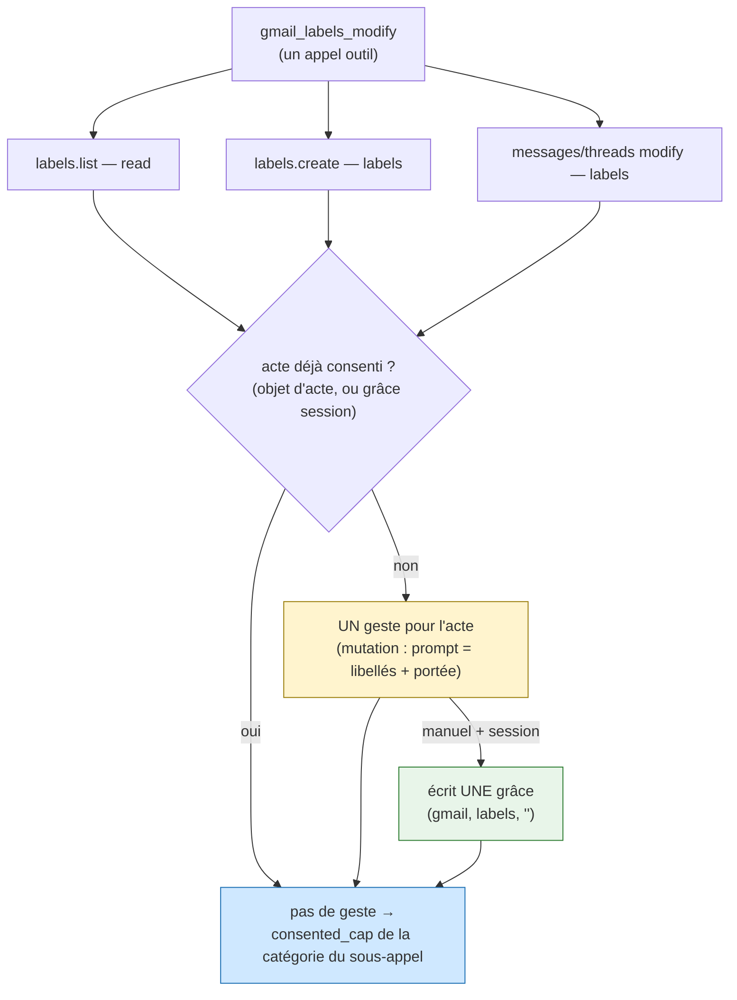

# ADR-0014 — `gmail_labels_modify` dans le modèle transactionnel : un acte multi-appels, un seul consentement

**Date** : 2026-10-01
**Statut** : proposé (applique ADR-0013 ; feature opt-in, OFF par défaut)
**Décideurs** : Thomas (mainteneur)
**S'appuie sur** : [ADR-0013](ADR-0013-consentement-une-fois-ou-session.md) · [ADR-0012](ADR-0012-consentement-transactionnel-propagation.md) · [ADR-0011](ADR-0011-consentement-transactionnel-par-session.md) · [ADR-0007](ADR-0007-droits-par-session.md)

> **En clair** — L'outil `gmail_labels_modify` (PR #156) n'était pas branché sur le consentement transactionnel : il était refusé dès la lecture interne et n'offrait pas le choix « pour la session ». On le branche. La difficulté propre : *un* appel d'outil = *plusieurs* appels au broker (lister les libellés, en créer, modifier messages, modifier threads) de *deux* catégories (`read` pour résoudre les noms, `labels` pour poser/retirer). On consent donc **une fois pour l'acte entier**, puis chaque sous-appel est autorisé sous ce consentement. En mode `manuel` + `session`, l'acte écrit **une** grâce *account-scoped* `(gmail, labels, "")` qui couvre aussi la lecture de résolution — jamais de grâce `gmail:read` large. *L'outil vérifie, l'humain autorise, le LLM propose.*

---

## Contexte

[ADR-0013](ADR-0013-consentement-une-fois-ou-session.md) a posé le consentement « une fois / pour la session » et l'a câblé sur les **mutations Drive** (`drive_create`, `drive_update`, `drive_copy`, `drive_upload`). Chacune est **un** appel outil = **un** appel broker = **un** geste.

`gmail_labels_modify` est arrivé **après** (PR #156) et n'a jamais été relié. Trois symptômes, reproductibles avec le CLI `gmail-cleanerz` comme avec l'agent en conversation :

1. **Lecture refusée.** L'outil appelle `labels.list` (catégorie `gmail.read`) pour résoudre nom → id. En transactionnel, le broker n'autorise un appel que par la **capacité consentie portée par cet appel** (ADR-0012, Zone 1), pas par les capacités persistées de la session. Sans consentement threadé : `read « gmail » outside session capabilities (gmail:read)`.
2. **Plus de déverrouillage par minutes.** ADR-0013 l'a retiré ; `session_unlock_in_conversation` renvoie vers « pour la session ». L'échappatoire hors-bande est fermée.
3. **Pas de `grant_scope`.** Le schéma MCP de l'outil ne l'expose pas ; l'acte ne peut pas porter le « pour la session ».

**Le point dur.** Contrairement à une mutation Drive, `gmail_labels_modify` se **déploie** en plusieurs appels broker de **deux catégories** :

```
labels.list      → read    (résolution des noms de libellés)
labels.create    → labels  (création des manquants, si create_missing)
messages.batchModify → labels  (pose/retrait sur les messages)
threads.modify   → labels  (pose/retrait, un appel par thread)
```

Gater chaque sous-appel séparément demanderait **plusieurs** Touch ID pour **un** « poser un libellé ». Et la lecture (`read`) et les écritures (`labels`) étant de catégories distinctes, une seule grâce `labels` ne suffirait pas à couvrir la lecture : il faut décider **comment un seul consentement couvre les deux**.



*Figure 1 — Les sous-appels d'un même acte convergent vers un point de décision unique. Le premier qui arrive (la lecture de résolution) déclenche LE geste de l'acte ; les suivants passent sans geste. En `manuel` + `session`, une grâce account-scoped est écrite, qui couvrira aussi la lecture des actes suivants.*

---

## Décision 1 — Un acte multi-appels, un seul consentement, via un objet d'acte

**Décision.** `gmail_labels_modify` crée un **objet d'acte** (un `dict` Python, `{"granted": False, "summary": …}`) et le thread, avec `grant_scope`, dans **chacun** de ses sous-appels `_run`. Le gate transactionnel (`_transactional_gate`) reconnaît un sous-appel d'acte de libellés et le route vers `_gmail_label_act_gate`. Celui-ci :

1. si l'acte est **déjà consenti** (`granted == True`, posé par un sous-appel précédent **du même acte**) → autorise sans geste ;
2. sinon, si une **grâce** `(gmail, labels, "")` couvre déjà la boîte (mode `manuel`) → marque l'acte consenti, autorise sans geste ;
3. sinon → **un** geste signé pour l'acte entier (une curation est une mutation → geste en `auto` comme en `manuel`), marque l'acte consenti, puis — si `manuel` + `session` — écrit la grâce.

Chaque sous-appel reçoit le `consented_cap` de **sa** catégorie : `read` pour `labels.list`, `labels` pour les écritures. Le broker re-vérifie chacun (Zone 1) — **inchangé**.

**Pourquoi un objet d'acte (en mémoire) et pas seulement la grâce.** La grâce ne vit qu'en mode `manuel` + `session`. Pour que `grant_scope=once` (le **défaut**) et le mode `auto` coûtent aussi **un seul** geste par acte, il faut mémoriser « l'acte est consenti » le temps de l'appel, sans rien persister. L'objet d'acte est cette mémoire : il naît et meurt avec l'appel `gmail_labels_modify`, n'est **jamais** exposé au schéma MCP (le client ne peut pas le fabriquer), et le gate ne l'honore que pour un sous-appel `gmail` de catégorie `read` ou `labels` (garde en amont ; tout le reste retombe sur le gate normal).

**Alternative rejetée.** Gater chaque sous-appel indépendamment (comme Drive). Rejetée : plusieurs Touch ID pour un acte — exactement l'« inutilisable » constaté.

**Repli fail-closed.** Objet d'acte absent → gate normal (geste par sous-appel). Catégorie hors `{read, labels}` sur un sous-appel d'acte → gate normal (jamais le raccourci d'acte). Geste refusé → `GatewayError(code="locked")`, aucune cible modifiée.

---

## Décision 2 — La grâce de curation est *account-scoped*, et couvre la lecture de résolution

**Décision.** En `manuel` + `session`, l'acte écrit **une seule** grâce `session_grant_capability_session_lived(sid, alias, "gmail", "labels", "")` — ressource **vide** (account-scoped). `session_has_capability` traite déjà une capacité **sans ressource** comme couvrant tout `service × opération` de ce compte. Le périmètre d'une curation de libellés **EST la boîte** : il n'existe pas de ressource plus fine qui soit stable (un `messages modify` porte `addLabelIds` **et** `removeLabelIds` → opérande ambigu, exclu de `_OPERAND_PARAM` à dessein depuis la fiche 0080).

Cette unique grâce `labels` couvre **aussi** la lecture `labels.list` de l'acte : `_gmail_label_act_gate` autorise le sous-appel `read` dès que l'acte est consenti (grâce présente ou geste passé). On ne persiste donc **jamais** de grâce `gmail:read`. C'est le « **sous-grant lié à l'acte** » : la lecture est subordonnée à l'acte de curation, pas un accès lecture Gmail autonome.

**Pourquoi account-scoped est sûr ici (et refusé pour Drive).** Pour Drive, une écriture sans ressource dérivable retombe sur « une fois » (ADR-0013 Décision 2) : une grâce Drive à l'échelle du service serait trop large. Pour les libellés, l'account-scope **est** le bon périmètre, et il reste **doublement borné** :

- par la **policy compte** `gmail.labels` (intersection ADR-0007, inchangée) ;
- par le **garde-fou « jamais de libellé système »** — `gmail_labels_modify` refuse TRASH/SPAM/INBOX… avant tout appel, et `categorize.gmail_labels_override` re-classe un `modify` touchant un libellé système en `delete`/`update` (donc **hors** `labels`), si bien que le `consented_cap` `(gmail, labels)` **ne l'autoriserait pas** au broker.

La grâce ne desserre donc que la **curation de libellés utilisateur** — jamais un envoi, une suppression, une corbeille, un partage.

**Alternative rejetée.** Persister une grâce `(gmail, read, "")` pour couvrir la résolution. Rejetée : une telle grâce autoriserait **toute** lecture Gmail de la session (messages, contenus) — bien au-delà de la résolution des noms. Le sous-grant lié à l'acte donne exactement ce qu'il faut, pas plus.

**Repli fail-closed.** Hors `manuel` (mode `auto`) ou **sous-session déléguée** → aucune grâce ; `scope` normalisé à `once` (reçu honnête). Échec d'écriture de la grâce → l'acte déjà approuvé **n'échoue pas** (filet, comme ADR-0013 lot 6).

---

## Décision 3 — `grant_scope` au bord, comme les mutations Drive

**Décision.** `grant_scope` (enum `once`/`session`, défaut `once`) est exposé au schéma MCP de `gmail_labels_modify` (`_GRANT_SCOPE_PROPERTY`), extrait au dispatch, ajouté à la signature `api.gmail_labels_modify`, et threadé dans ses `_run`. **Jamais** sur le partage ni les brouillons (garde-fou ADR-0013 Décision 4, inchangé). Le LLM remplit ce paramètre quand l'utilisateur dit « pour la session » ; l'humain **lit** la portée dans le prompt Touch ID et confirme.

**Conséquence.** L'ergonomie rejoint Drive : un paramètre unique, un reçu signé qui nomme l'acte (`gmail:users:labels:modify`), les libellés posés/retirés et leur nombre de cibles, et la portée choisie.

---

## Repli fail-closed (synthèse)

- Flag transactionnel OFF → comportement d'avant, bit pour bit (l'objet d'acte est ignoré).
- Portée absente/inconnue → `once`. Mode `auto` / sous-session → `session` normalisé à `once`, aucune grâce.
- Objet d'acte absent, ou sous-appel hors `gmail:{read,labels}` → gate normal (geste par sous-appel).
- Libellé système → refusé en amont ET re-classé hors `labels` → non autorisé par le cap de l'acte.
- Geste refusé, cap illisible, verrou en échec → refus, jamais un accès ; aucune cible modifiée.
- Le partage et les brouillons n'ont ni `grant_scope` ni grâce.

---

## Conséquences

- **Utilisable.** Poser `gc/to-delete` sur un thread coûte **un** geste « pour la session » ; les actes suivants dans la session, **zéro**. La lecture de résolution est couverte sans octroi séparé.
- **Sûr.** La seule chose desserrée « pour la session » est la curation de libellés utilisateur sur une boîte, bornée par policy + garde système. Aucune grâce `gmail:read` large n'existe.
- **Sans dette.** Réutilise la plomberie d'ADR-0013 (`session_grant_capability_session_lived`, `session_has_capability`, `_consented_cap`, `run_elicitation_gate`, `categorize`) ; aucune source de vérité dupliquée ; le broker est inchangé.

---

## Références

- ADR : [ADR-0013](ADR-0013-consentement-une-fois-ou-session.md) (appliqué ici), [ADR-0012](ADR-0012-consentement-transactionnel-propagation.md), [ADR-0011](ADR-0011-consentement-transactionnel-par-session.md), [ADR-0007](ADR-0007-droits-par-session.md).
- Fiche : `features/20261001214857000_gmail-labels-modify-transactionnel.md`.
- Code : `gateway/api.py` (`gmail_labels_modify`, `_run`, `_transactional_gate`, `_gmail_label_act_gate`, `_consented_cap`, `_is_delegated_session`), `gateway/sessions.py` (`session_grant_capability_session_lived`, `session_has_capability`), `gateway/categorize.py` (`categorize`, `gmail_labels_override`, `operand_resource`), `gateway/mcp_server.py` (`_GRANT_SCOPE_PROPERTY`, schéma + dispatch), `gateway/broker_server.py` (Zone 1 — inchangé).
