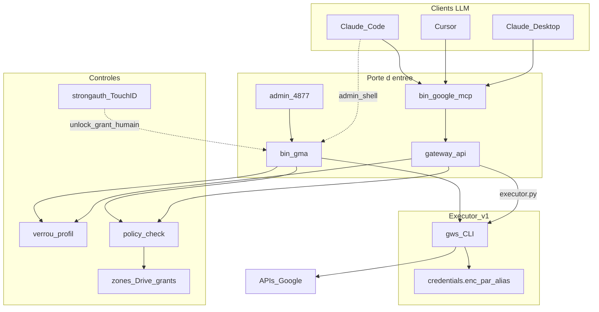

# Sous le capot — l'architecture

Cette page explique **comment le projet est bâti** : quelles pièces existent, qui
parle à qui, et — surtout — **où se trouvent les garde-fous** qui empêchent
l'assistant d'agir tout seul. Elle s'adresse à qui veut comprendre ou auditer ; pour
juste démarrer, allez plutôt à **[Démarrer](demarrer.md)**.

Un seul principe traverse tout ce qui suit :

> **L'outil vérifie, l'humain autorise, le LLM propose.**
> L'assistant peut *demander* un accès ; il ne peut jamais se l'accorder lui-même.

## L'idée en une image

Tout tourne **sur votre machine** — rien n'est hébergé dans un cloud applicatif.
Votre assistant parle au serveur MCP ; le serveur passe par une **gateway** qui
vérifie deux choses avant chaque appel à Google : le compte est-il **déverrouillé** ?
l'action est-elle **autorisée par la policy** ? Vous, l'humain, agissez d'un autre
côté — la CLI `gma` ou l'interface admin — pour ouvrir ou fermer ces accès. Les deux
côtés se rejoignent sur le même **état** (verrous, autorisations, policy) sans que
l'un puisse commander l'autre.



Les diagrammes de séquence détaillés (lecture de données, connexion de compte,
réparation d'accès) sont dans [`diagrams/`](https://github.com/elzinko/google-mcp-multi-account/tree/main/diagrams/).

## Où vivent les choses

Sur le poste, six couches se relaient :

| Couche | Artefact | Rôle |
|--------|----------|------|
| Clients LLM | Claude Desktop, Cursor, Claude Code | Appellent le MCP (données) ou le shell (admin) |
| MCP | [`bin/google-mcp`](https://github.com/elzinko/google-mcp-multi-account/blob/main/bin/google-mcp) → [`gateway/`](https://github.com/elzinko/google-mcp-multi-account/tree/main/gateway/) | La porte d'entrée **recommandée** pour Gmail/Drive |
| CLI humaine | [`bin/gma`](https://github.com/elzinko/google-mcp-multi-account/blob/main/bin/gma) | Multi-comptes : `add`, `lock`/`unlock`, `grant`, `policy` |
| Cockpit humain | [`admin/server.js`](https://github.com/elzinko/google-mcp-multi-account/blob/main/admin/server.js) `127.0.0.1:4877` | Interface web locale (jamais exposée hors loopback) |
| Policy | [`scripts/policy-check.py`](https://github.com/elzinko/google-mcp-multi-account/blob/main/scripts/policy-check.py) | Vérifie « default-deny » avant tout appel à Google |
| Exécution Google | `gws` + `~/.config/gws-accounts/<alias>/` | Tokens chiffrés + appels API |

Depuis la Phase 2 A, `gws` n'est plus lancé un peu partout : un **broker** local
([`bin/google-broker`](https://github.com/elzinko/google-mcp-multi-account/blob/main/bin/google-broker),
démarré tout seul, écoute sur `127.0.0.1:4878`) est le **seul** à l'exécuter pour
accéder aux données. La gateway ne fait plus que lui parler. Les identifiants restent
sous `~/.config/gws-accounts/` (le vault dédié est prévu — [fiche 0003](https://github.com/elzinko/google-mcp-multi-account/blob/main/features/0003-vault-credentials-hors-perimetre-agent.md)).

### Deux noms à ne pas confondre : le dépôt et le connecteur { #noms-depot-connecteur }

Vous croiserez deux identifiants très proches. Ce n'est pas une incohérence, c'est la
convention MCP :

| Nom | Ce qu'il désigne | Où on le voit |
|-----|------------------|---------------|
| **`google-mcp-multi-account`** | le **dépôt / projet** (et le nom que le serveur annonce, `mcp_server.py:SERVER_NAME`) | URL GitHub, dossier cloné, binaire `bin/google-mcp`, install `~/.local/share/google-mcp/` |
| **`google-multi-account`** | le **connecteur installé** — la clé sous `mcpServers` dans la config client | Claude Desktop → Connecteurs, `claude mcp get` |

Le dépôt porte `mcp` (découvrable, il s'auto-décrit) ; le connecteur est plus court
car il vit déjà sous `mcpServers` — y répéter « mcp » serait redondant. Même schéma
partout : `github/github-mcp-server` → connecteur `github` ; le paquet
`mcp-server-git` → connecteur `git`. La CLI, elle, s'appelle **`gma`**.

## Les composants, un par un

### La gateway (`gateway/`)

C'est le cœur : elle reçoit les appels du serveur MCP et n'en laisse passer aucun
sans contrôle.

| Module | Responsabilité |
|--------|----------------|
| `api.py` | Le contrat public : `profiles_list`, `gmail_*`, `drive_*`, `access_request` |
| `profiles.py` | Alias, verrous, listage des profils |
| `executor.py` | Client RPC vers le broker (plus aucun appel `gws` ici) |
| `broker_server.py` | Le daemon `127.0.0.1:4878` — verrou + policy + journal + `gws` |
| `default_policy.py` | La policy « prudente » écrite à `gma add` |
| `mcp_server.py` | L'adaptateur MCP stdio (JSON-RPC, **stdlib seule**) |
| `errors.py` | `GatewayError` (`locked`, `policy`, `alias`, …) |

Concrètement, un appel comme `gmail_list` traverse cinq étapes : on **valide l'alias**,
on **refuse si le profil est verrouillé** (avec un message d'élicitation), on passe la
commande au **policy-check**, on **journalise**, puis seulement on exécute. Et
`access_request` ne déverrouille ni n'accorde jamais rien : il **renvoie la commande
exacte** que l'humain devra lancer (`gma unlock`, `gma grant`).

### Les tools MCP exposés

Volontairement peu nombreux et sans surprise — pas de tool générique « lance n'importe
quelle commande ». Chacun lit ou écrit précisément :

| Tool | Effet | Envoi mail ? |
|------|-------|--------------|
| `profiles_list` | Liste alias / verrou / policy | — |
| `gmail_list` / `gmail_get` | Lecture | Non |
| `gmail_draft_create` | Brouillon | Non (aucun tool `send`) |
| `gmail_attachment_get` | Lecture — PJ écrite dans `.downloads` ([ADR-0006](adr/ADR-0006-fichiers-recus-repertoire-dedie.md)) | — |
| `drive_list` / `drive_get` | Lecture, propriétaire compris | — |
| `drive_read` | Contenu en texte (Doc → markdown, Sheet → CSV) | — |
| `drive_create` / `drive_update` | Création / modification sous zone autorisée ([ADR-0003](adr/ADR-0003-contenu-drive-via-depot-broker.md)) | — |
| `drive_copy` / `drive_upload` | Copie native / téléversement, sous zone | — |
| `drive_permissions_*` | Partage lecture/écriture (policy `share`) | — |
| `access_request` | Renvoie une commande à faire exécuter par l'humain | — |

### La CLI `gma`

Le poste de pilotage humain. Elle isole chaque compte dans son propre répertoire
(`~/.config/gws-accounts/<alias>/`), écrit une policy prudente à la connexion, et
expose les contrôles humains (`lock`, `unlock`, `grant`, `policy`). Avant tout appel à
`gws`, elle vérifie le verrou puis la policy. Ses interpréteurs sont en chemin
**absolu** (`/usr/bin/python3`, `/usr/bin/swift`) — un faux `python3` en tête de PATH
ne peut donc pas désactiver la policy en douce.

### La policy (`policy-check.py`)

Quand un `policy.json` existe, la règle est **« default-deny »** :

| Règle | Comportement |
|-------|----------------|
| Service **non déclaré** | **Refus** (ex. `chat`, `meet`) |
| Service déclaré | Fail closed par catégorie (`read`, `send`, `create`, …) |
| Drive `zonesOnly` | Écriture seulement sous les dossiers autorisés ∪ grants temporaires |
| JSON corrompu | Refus (fail closed) |

Le préréglage par défaut est délibérément prudent (`gateway/default_policy.py`) :
Drive sans zone d'écriture, Gmail en lecture + brouillons **sans envoi**, le reste
essentiellement en lecture.

### L'interface admin

Une petite UI web locale, pensée pour rester inoffensive : elle n'écoute **que** sur
`127.0.0.1:4877`, exige un en-tête `X-GWSA-Admin` et vérifie l'`Origin` (anti-CSRF),
n'agit que via `execFile(gma)` (jamais un shell), et n'a pas d'authentification
applicative — la confiance, c'est « on est sur la machine locale ».

### Où sont les secrets

| Élément | Emplacement |
|---------|-------------|
| Tokens OAuth chiffrés | `~/.config/gws-accounts/<alias>/credentials.enc` |
| Clé maître | Trousseau macOS (`gws-cli`), via `gws` |
| `client_secret.json` | `~/.config/gws-accounts/` (hors dépôt) |
| Policy / grants / verrou | Fichiers dans le dossier du profil |
| Journal | `~/.config/gws-accounts/usage.jsonl` |

## Ce que chaque garde-fou protège — et sa limite

Le tableau est volontairement honnête sur la dernière colonne : chaque contrôle a une
condition qui le contourne.

| Contrôle | Où | Contre quoi | Contournable si… |
|----------|-----|-------------|------------------|
| Policy default-deny | `policy-check.py` | Envoi, services non listés, écritures hors zone | L'agent appelle `gws` **hors** `gma`/gateway |
| Zones Drive + grants | policy + `session-grants.json` | Écriture hors dossiers autorisés | Idem, `gws` nu |
| Verrou profil | `.locked` / `.unlock-until` | Accès sans votre feu vert | Édition des fichiers, ou `gws` nu |
| Tools MCP sans `send` | `mcp_server.py` | Envoi de mail via le MCP | Un autre client / le shell |
| `access_request` non exécutant | `api.py` | Auto-déverrouillage par le LLM | L'humain (ou un agent) exécute la commande |
| Touch ID (strongauth) | `touchid.swift` | Unlock/grant sans présence physique | PATH falsifié : **non** (swift absolu) ; fichiers verrou éditables : oui |
| Admin loopback + anti-CSRF | `admin/server.js` | Un site web distant | Un processus **local** malveillant |
| Journal `usage.jsonl` | 3 chemins d'écriture | Audit coopératif | `GWSA_CLIENT` est falsifiable |

**En clair (Phase 1) :** c'est la **discipline d'un agent coopératif** (MCP + policy +
verrou), pas une prison. Ce n'est **pas** une isolation contre un agent qui aurait un
shell libre et accès aux fichiers d'identifiants — c'est dit noir sur blanc dans le
**[modèle de menace](threat-model.md)**.

## Les trois chemins à connaître

**Le chemin supporté** (les données passent par là) :

```text
LLM  →  tools MCP  →  gateway  →  policy + verrou  →  broker (gws)  →  Google
```

**Le chemin humain** (vous ouvrez/fermez les accès) :

```text
Humain  →  admin OU gma unlock|grant|policy  →  (Touch ID ?)  →  fichiers du profil
```

**Le chemin à bloquer** côté permissions de l'agent :

```text
LLM  →  shell  →  GOOGLE_WORKSPACE_CLI_CONFIG_DIR=… gws …
```

La parade : refuser à l'agent, dans ses permissions shell, l'appel `gws` nu et
l'édition de `~/.config/gws-accounts/` — les données ne passent **que** par le MCP.

## Où en est le produit

| Phase | État | Contenu |
|-------|------|---------|
| **1** | **Déployée** | MCP + gateway + default-deny + docs |
| **2 A** | **Déployée** | Broker loopback : `gws` uniquement dans le broker |
| **2.1** | Prévue — [fiche 0003](https://github.com/elzinko/google-mcp-multi-account/blob/main/features/0003-vault-credentials-hors-perimetre-agent.md) | Vault des identifiants hors de portée de l'agent |
| **3** | Idée — [fiche 0001](https://github.com/elzinko/google-mcp-multi-account/blob/main/features/0001-elicitation-signee-strongauth-v2.md) | Élicitation signée par la Secure Enclave |

## Pour aller vite

Les fichiers qui comptent, et de quoi vérifier que tout va bien :

```text
bin/google-mcp          # entrée MCP stdio
bin/google-broker       # daemon (exécute gws)
bin/gma                 # la CLI multi-comptes
gateway/                # API + MCP + executor + broker
scripts/policy-check.py # application de la policy
admin/server.js         # UI 127.0.0.1:4877
```

```bash
./scripts/test.sh                 # policy + gateway + smoke MCP (hermétique)
gma list                          # vos comptes
gma policy vous@gmail.com show    # la policy active d'un compte
```
