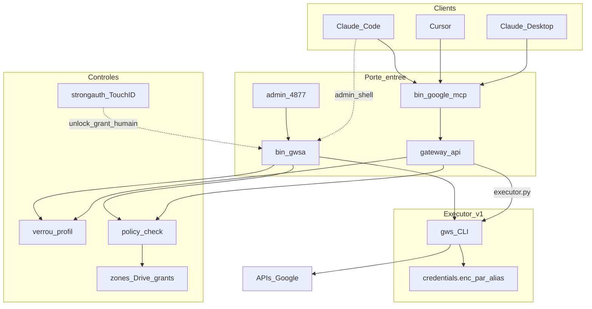

# Architecture — google-mcp-multi-account

Document de référence : **ce qui est déployé aujourd’hui (Phase 1)**, comment les
pièces s’assemblent, et ce que chaque contrôle de sécurité couvre (ou non).

Compléments :
- Branchement clients MCP → [mcp-setup.md](mcp-setup.md)
- Modèle de menace / limites → [threat-model.md](threat-model.md)
- OAuth one-shot → [setup-oauth.md](setup-oauth.md)

---

## 1. Vue d’ensemble

Rien n’est hébergé dans le cloud applicatif. Sur la machine :

| Couche | Artefact | Rôle |
|--------|----------|------|
| Clients LLM | Claude Desktop, Cursor, Claude Code | Appellent le MCP (données) ou le shell (admin) |
| MCP | [`bin/google-mcp`](../bin/google-mcp) → [`gateway/`](../gateway/) | Seule porte d’entrée **recommandée** pour Gmail/Drive |
| CLI admin | [`bin/gwsa`](../bin/gwsa) | Multi-profils, unlock/grant/policy, legacy shell |
| Cockpit humain | [`admin/server.js`](../admin/server.js) `127.0.0.1:4877` | UI locale (jamais exposée hors loopback) |
| Policy | [`scripts/policy-check.py`](../scripts/policy-check.py) | Default-deny avant tout appel `gws` |
| Exécution Google | `gws` + `~/.config/gws-accounts/<alias>/` | Tokens chiffrés + appels API |



**Broker Phase 2 A :** `gateway/executor.py` parle au daemon
[`bin/google-broker`](../bin/google-broker) (auto-start). Seul le broker exécute
`gws` pour les accès aux données (la découverte lit encore `gws auth status` en
direct). Les credentials restent sous `~/.config/gws-accounts/` (pas encore de
vault — fiche 0003).

---

## 2. Composants précis

### 2.1 Gateway (`gateway/`)

| Module | Responsabilité |
|--------|----------------|
| `api.py` | Contrat public : `profiles_list`, `gmail_*`, `drive_*`, `access_request` |
| `profiles.py` | Alias, lock, listage profils |
| `executor.py` | **Phase 2 A** : client RPC vers le broker (plus d’appel `gws` ici) |
| `broker_server.py` | Daemon `127.0.0.1:4878` — lock + policy (`policy-check.py`) + journal + `gws` |
| `default_policy.py` | JSON « prudent » écrit à `gwsa add` |
| `mcp_server.py` | Adaptateur MCP stdio (JSON-RPC newline-delimited, **stdlib only**) |
| `errors.py` | `GatewayError` (`locked`, `policy`, `alias`, …) |

Flux d’un tool MCP (ex. `gmail_list`) :

1. Validation alias  
2. Refuse si profil verrouillé → message d’élicitation  
3. `policy-check` sur la commande `gws` équivalente  
4. Journalisation `GWSA_CLIENT=mcp`  
5. `executor.run_gws(...)`  

`access_request` **ne déverrouille pas** et **n’accorde pas** de zone : il renvoie
la commande exacte à faire exécuter par l’humain (`gwsa unlock` / `gwsa grant`).

### 2.2 Tools MCP exposés (v1)

| Tool | Effet | Envoi mail ? |
|------|-------|--------------|
| `profiles_list` | Liste alias / lock / policy | — |
| `gmail_list` / `gmail_get` | Lecture | Non |
| `gmail_draft_create` | Brouillon | Non (pas de tool `send`) |
| `drive_list` / `drive_get` | Lecture | — |
| `drive_create` | Création sous `parent_id` (zones) | — |
| `access_request` | Texte d’élicitation seulement | — |

Pas de `gwsa_run` générique : surface volontairement réduite.

### 2.3 Wrapper `gwsa`

- Isole chaque compte : `~/.config/gws-accounts/<alias>/`
- `add` : OAuth + **écrit la policy prudente** si absente
- `lock` / `unlock` / `grant` / `policy` : contrôles humains
- Avant `gws` : lock puis `policy-check.py`
- Interpréteurs en chemins absolus : `/usr/bin/python3`, `/usr/bin/swift`

### 2.4 Policy (`policy-check.py`)

Quand un `policy.json` est présent :

| Règle | Comportement |
|-------|----------------|
| Service **non déclaré** | **Refus** (default-deny) — ex. `chat`, `meet` |
| Service déclaré | Fail closed sur les catégories (`read`, `send`, `create`, …) |
| Drive `zonesOnly` | Écriture seulement sous `writeFolders` ∪ grants temporaires |
| `auth` / `schema` | Passthrough (pas des APIs données) |
| JSON corrompu | Refus (fail closed) |

Preset prudent (défaut à la création) : voir `gateway/default_policy.py` —
Drive zones vides, Gmail read+drafts sans send, Calendar/Docs/Sheets/Tasks
essentiellement lecture.

### 2.5 Admin locale

- Bind **uniquement** `127.0.0.1:4877`
- Header `X-GWSA-Admin` + contrôle Origin (anti-CSRF)
- Actions via `execFile(gwsa)` — pas de shell
- Pas d’authentification applicative (confiance = machine locale)

### 2.6 Stockage secrets

| Élément | Emplacement |
|---------|-------------|
| Tokens OAuth chiffrés | `~/.config/gws-accounts/<alias>/credentials.enc` |
| Clé maître | Trousseau macOS (`gws-cli`) via `gws` |
| `client_secret.json` | `~/.config/gws-accounts/` (hors repo) |
| Policy / grants / lock | Fichiers dans le dir profil |
| Journal | `~/.config/gws-accounts/usage.jsonl` |

---

## 3. Carte des contrôles de sécurité

| Contrôle | Où | Contre quoi | Contournable si… |
|----------|-----|-------------|------------------|
| Policy default-deny | `policy-check.py` | Envoi, services non listés, écritures hors catégories | Agent appelle `gws` hors `gwsa`/gateway |
| Zones Drive + grants | policy + `session-grants.json` | Écriture hors dossiers autorisés | Idem bypass `gws` nu |
| Verrou profil | `.locked` / `.unlock-until` | Accès sans élicitation | Édition fichiers ou `gws` nu |
| Tools MCP sans send | `mcp_server.py` | Envoi mail via MCP | Shell / autre client |
| `access_request` non exécutant | `api.py` | Auto-unlock par le LLM | Humain (ou agent) exécute la commande |
| Strongauth Touch ID | `touchid.swift` via `/usr/bin/swift` | Unlock/grant sans présence | PATH falsifié **non** (swift abs.) ; fichiers lock éditables oui |
| Admin loopback + CSRF header | `admin/server.js` | Site web distant | Processus **local** malveillant |
| Journal `usage.jsonl` | logger + policy + refus de verrou (3 chemins) | Audit coopératif | `GWSA_CLIENT` spoofable |

**Synthèse Phase 1 :** discipline d’un agent **coopératif** (MCP + policy + lock).
**Pas** une isolation contre un agent avec shell libre et accès au filesystem
des credentials — voir [threat-model.md](threat-model.md).

---

## 4. Chemins d’appel (à connaître)

### Chemin supporté (données)

```text
LLM  →  MCP tools  →  gateway.api  →  policy + lock  →  executor v1 (gws)  →  Google
```

### Chemin admin humain

```text
Humain  →  admin UI ou gwsa unlock|grant|policy  →  (strongauth?)  →  fichiers profil
```

### Chemin à éviter / à bloquer côté permissions agent

```text
LLM  →  shell  →  GOOGLE_WORKSPACE_CLI_CONFIG_DIR=… gws …
```

Mitigation : permissions bash refusant `gws` et `~/.config/gws-accounts/` ;
données uniquement via MCP.

---

## 5. Phases produit

| Phase | État | Contenu |
|-------|------|---------|
| **1** | **Déployée** | MCP + gateway + default-deny + docs |
| **2 A** | **Déployée (ce chantier)** | Broker loopback : `bin/google-broker` / auto-start ; `executor.py` = client RPC ; `gws` seulement dans le broker |
| **2.1** | Fiche [0003](../features/0003-vault-credentials-hors-perimetre-agent.md) | Vault credentials hors périmètre agent |
| **3** (idée) | Fiche [0001](../features/0001-elicitation-signee-strongauth-v2.md) | Élicitation signée Secure Enclave |

---

## 6. Fichiers clés (index)

```text
bin/google-mcp          # entrée MCP stdio
bin/google-broker       # daemon Phase 2 A (gws)
bin/gwsa                 # CLI multi-comptes
gateway/                 # API + MCP + executor RPC + broker_server
scripts/policy-check.py  # enforcement policy
scripts/log-usage.py     # journal ok
scripts/touchid.swift    # strongauth
admin/server.js          # UI 127.0.0.1:4877
docs/architecture.md     # ce document
docs/threat-model.md     # garanties / non-garanties
docs/mcp-setup.md        # config Desktop / Cursor / Code
```

## 7. Vérifications rapides

```bash
./scripts/test.sh                    # policy + gateway + smoke MCP
printf '%s\n' '{"jsonrpc":"2.0","id":1,"method":"tools/list","params":{}}' \
  | ./bin/google-mcp                 # liste des tools
gwsa list                            # profils
gwsa policy <alias> show             # policy active
```
