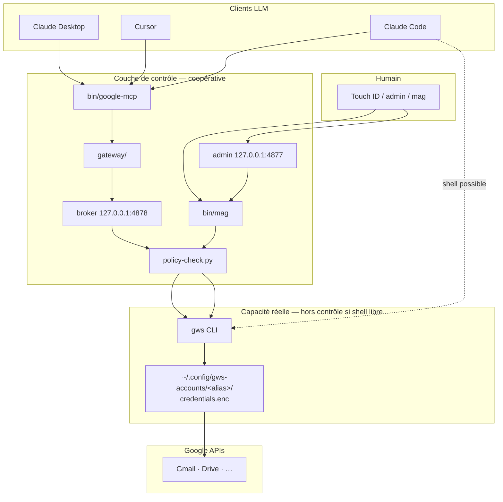
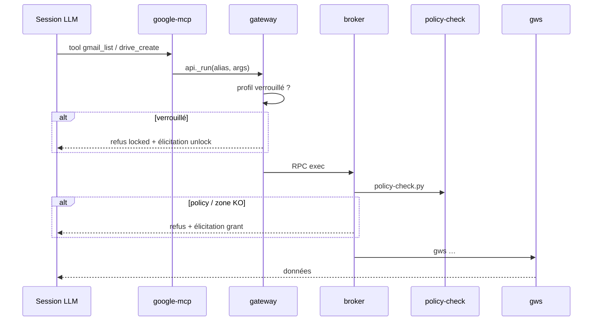
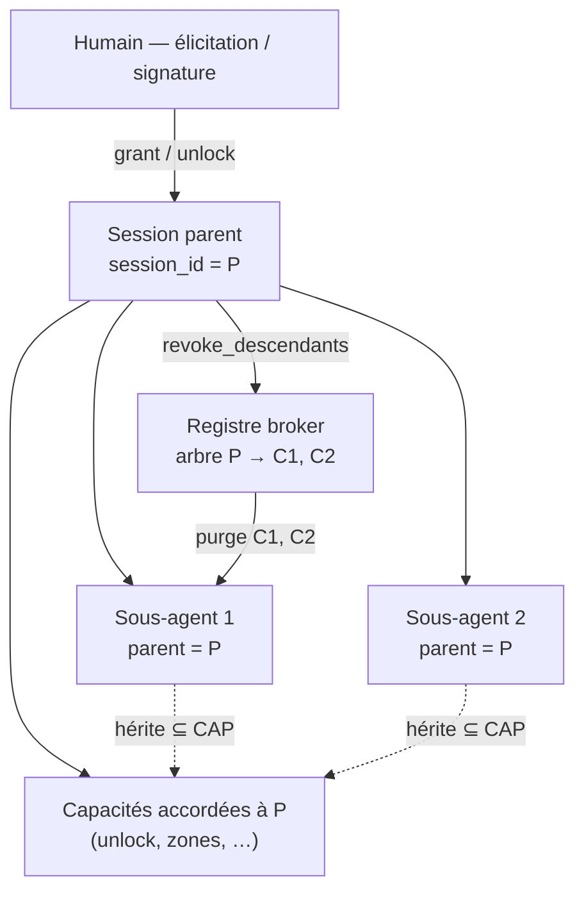
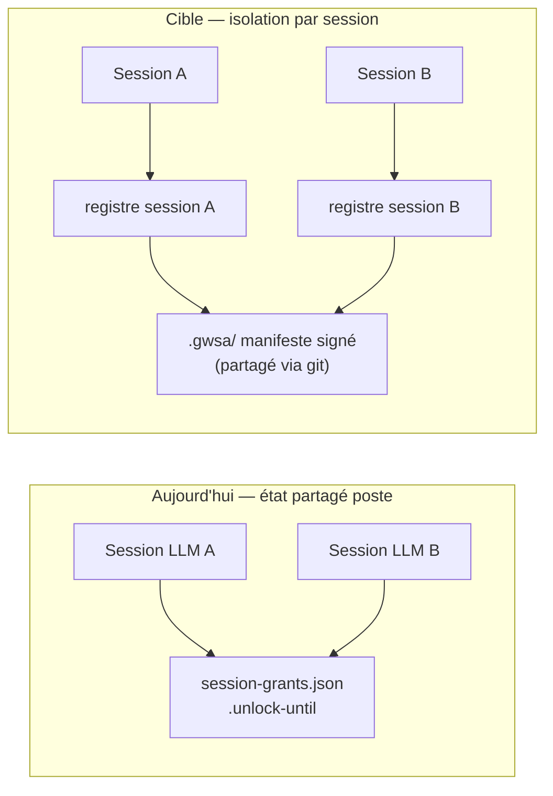
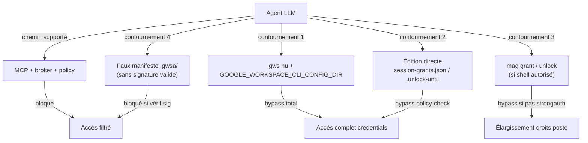
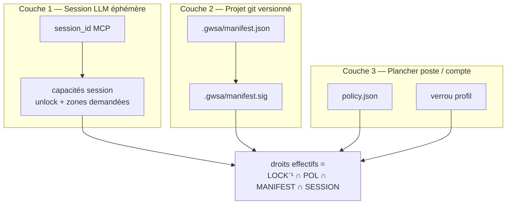
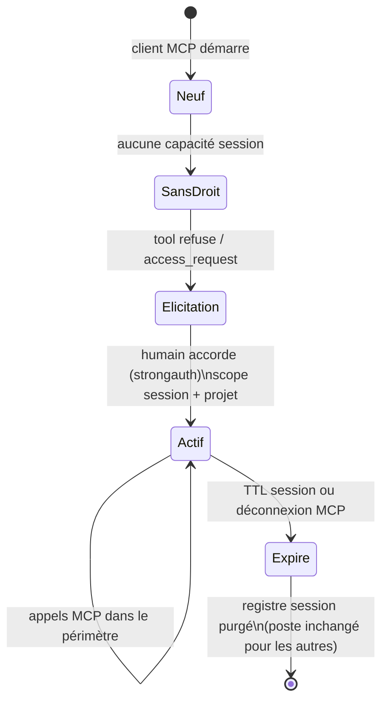

> ⚠️ **Statut de ce document.** C'est l'**état des lieux initial** (2026-07-28). Le **modèle retenu** — identité par **geste de consentement signé**, **jeton porté dans l'appel**, **cycle de vie découplé de la connexion MCP** (TTL + révocation explicite) — est défini par **[ADR-0007](../docs/adr/ADR-0007-droits-par-session.md)** et la fiche **[0076](0076-droits-par-session-phase-a.md)**, qui **remplacent toute assertion de ce document liant l'identité ou le cycle de vie à la connexion MCP** — notamment §2.6, §3.x, la machine à états §5.2 et sa table de cycle de vie, les scénarios TGT-0x (§3.4), les critères Phase A (§7) et l'état d'implémentation (§10).

## Résumé exécutif

Ce document sert de **base de décision** avant toute implémentation. Il décrit
l'état actuel des droits sur un poste (avec scénarios BDD), les écarts par
rapport à l'intention produit, les limites de sécurité, puis les pistes de
solution.

**Intention produit (à valider)** :

1. **Repartir de zéro à chaque session LLM** — chaque conversation / instance
   client a **ses propres droits**, indépendants des autres sessions ouvertes en
   parallèle.
2. **Une couche de gestion** est nécessaire car aujourd'hui les autorisations
   sont **globales au poste** : un `grant` ou un `unlock` profite à toutes les
   sessions sur la machine.
3. **À terme**, lier un périmètre d'accès au **projet git** (worktrees, merge,
   clone) via un manifeste signé — sans que l'agent puisse s'auto-attribuer des
   droits.

**Ce n'est pas encore une spec d'implémentation** : les sections finales
proposent des directions, pas un design figé.

---

## 1. Comment Google Workspace fonctionne sur un poste

### 1.1 Les acteurs



| Composant | Rôle | Toujours démarré ? |
|-----------|------|-------------------|
| `gws` | CLI Google Workspace ; lit les tokens chiffrés | Non — invoqué à la demande |
| `mag` | Wrapper multi-comptes : lock, grant, policy, puis `gws` | Non — par commande |
| `bin/google-mcp` | Serveur MCP stdio ; tools curatés | Lancé par le client LLM |
| `broker` | Seul exécuteur `gws` pour le MCP ; re-vérifie lock + policy | Auto-start au 1er tool MCP |
| `admin` | Cockpit humain (unlock, grants, policy, journal) | **Non** — `mag admin` à la demande |
| `policy-check.py` | Default-deny avant chaque appel `gws` (via mag ou broker) | Non — subprocess |

### 1.2 Où vivent les secrets et les droits

Tout est sous `~/.config/gws-accounts/` (ou `GWSA_ROOT`), **par machine** :

```
~/.config/gws-accounts/
├── usage.jsonl                    # journal global (tous clients, toutes sessions)
├── .broker-token                  # jeton RPC broker (loopback)
├── .strong-auth                   # flag Touch ID obligatoire pour unlock/grant
└── <alias>/                       # un dossier par compte Google
    ├── credentials.enc            # tokens OAuth chiffrés (Trousseau macOS)
    ├── policy.json                # plancher global : services, zones permanentes
    ├── session-grants.json        # zones Drive TEMPORAIRES (horloge murale)
    ├── .locked                    # présent = profil en « accès sur demande »
    ├── .unlock-until              # timestamp Unix : déverrouillage temporaire
    └── .email                     # métadonnée identité (lisible même verrouillé)
```

**Point clé** : il n'existe **aucun fichier « session LLM »**. Les droits sont
partagés entre toutes les conversations et tous les clients sur ce poste.

### 1.3 Les trois leviers de droits (aujourd'hui)

| Levier | Commande / geste | Fichier | Portée | Expiration par défaut |
|--------|------------------|---------|--------|----------------------|
| **Verrou** | `mag lock <alias>` | `.locked` | Compte entier (lecture + écriture) | — |
| **Déverrouillage** | `mag unlock <alias> [min]` | `.unlock-until` | Compte entier | **60 min**, puis reverrouillage |
| **Déverrouillage permanent** | `mag unlock <alias> off` | supprime `.locked` | Compte entier | Jamais (jusqu'à `lock`) |
| **Zone Drive temporaire** | `mag grant <alias> "<dossier>" [h]` | `session-grants.json` | Écriture sous ce dossier | **8 h** (1–168 h) |
| **Zone Drive permanente** | `mag policy <alias> allow "<dossier>"` | `policy.json` | Écriture sous ce dossier | Jamais (jusqu'à `revoke`) |
| **Policy services** | admin / `mag policy` | `policy.json` | Gmail, Calendar, etc. | Jamais |

**Ce qui ne déclenche aucune expiration** : fermer une discussion, fermer
Claude Desktop, ouvrir une nouvelle conversation, lancer un second client LLM.

### 1.4 Chaîne d'enforcement (chemin coopératif)



---

## 2. État actuel — scénarios BDD

Légende :

- **Préconditions communes** : profils `mw` et `perso` connectés, policy prudente
  (Drive `zonesOnly`, zones vides, Gmail lecture + brouillons sans envoi), profils
  **non verrouillés** sauf mention contraire.
- **Session LLM** = une conversation Claude Desktop, un chat Cursor, ou une
  session Claude Code — **sans identifiant technique** côté mag aujourd'hui.

### 2.1 Accès au compte (verrou / déverrouillage)

```gherkin
Fonctionnalité: Verrou profil — accès global au compte

  Scénario: ACT-01 — Profil verrouillé refuse toute lecture
    Étant donné que le profil "mw" est verrouillé (fichier .locked présent)
    Et qu'aucun déverrouillage n'est en cours
    Quand une session LLM appelle gmail_list sur "mw"
    Alors l'appel est refusé (code locked)
    Et une ligne est écrite dans usage.jsonl (decision:refus, reason:locked)

  Scénario: ACT-02 — Déverrouillage temporaire partagé entre sessions
    Étant donné que le profil "mw" est verrouillé
    Et que l'humain exécute "mag unlock mw 60"
    Quand la session LLM A appelle gmail_list sur "mw"
    Et que la session LLM B (autre conversation, même poste) appelle gmail_list sur "mw"
    Alors les deux appels sont autorisés
    Et après 60 minutes sans nouveau unlock, les deux sessions sont à nouveau refusées

  Scénario: ACT-03 — Fermer le client LLM ne reverrouille pas
    Étant donné que "mw" a été déverrouillé pour 60 minutes
    Quand l'humain ferme Claude Desktop
    Et rouvre Claude Desktop dans une nouvelle conversation
    Alors gmail_list sur "mw" reste autorisé jusqu'à expiration des 60 minutes

  Scénario: ACT-04 — unlock off retire le verrou définitivement
    Étant donné que "mw" est verrouillé
    Quand l'humain exécute "mag unlock mw off"
    Alors toutes les sessions futures sur ce poste accèdent à "mw" sans unlock
    Jusqu'à un prochain "mag lock mw"
```

### 2.2 Zones Drive (grants temporaires et policy)

```gherkin
Fonctionnalité: Zones d'écriture Drive

  Scénario: ACT-05 — Grant temporaire partagé entre sessions parallèles
    Étant donné que l'humain a exécuté 'mag grant mw "Compta 2026" 8'
    Quand la session LLM A appelle drive_create sous ce dossier
    Et que la session LLM B appelle drive_create sous le même dossier
    Alors les deux appels sont autorisés immédiatement
    Sans que la session B ait demandé le grant

  Scénario: ACT-06 — Nouvelle conversation hérite des grants actifs
    Étant donné qu'un grant "Compta 2026" a été accordé il y a 2 heures (durée 8 h)
    Quand l'humain ouvre une nouvelle conversation Claude Desktop
    Alors drive_create sous "Compta 2026" est autorisé
    Car le grant est stocké dans session-grants.json sur le poste

  Scénario: ACT-07 — Expiration du grant à l'horloge murale
    Étant donné qu'un grant a été accordé pour 4 heures il y a 5 heures
    Quand une session LLM appelle drive_create sous ce dossier
    Alors l'appel est refusé (zone inactive)
    Quelle que soit la session LLM

  Scénario: ACT-08 — Fermer le LLM ne révoque pas le grant
    Étant donné un grant actif
    Quand toutes les fenêtres Claude Desktop sont fermées
    Et qu'une nouvelle session est ouverte 10 minutes plus tard
    Alors le grant est toujours actif (temps restant ≈ durée initiale − 10 min)

  Scénario: ACT-09 — Zone permanente (policy) sans expiration horaire
    Étant donné que l'humain a exécuté 'mag policy mw allow "LLM"'
    Quand une session LLM appelle drive_create sous "LLM"
    Alors l'appel est autorisé
    Et cela reste vrai des jours plus tard, toutes sessions confondues
```

### 2.3 Clients LLM et journal

```gherkin
Fonctionnalité: Identification client (audit seulement)

  Scénario: ACT-10 — GWSA_CLIENT différencie le journal, pas les droits
    Étant donné un grant actif sur "mw"
    Et que Claude Desktop utilise GWSA_CLIENT=claude-desktop
    Et que Cursor utilise GWSA_CLIENT=cursor
    Quand les deux appellent drive_create sur la même zone
    Alors les deux réussissent avec les mêmes droits effectifs
    Et usage.jsonl contient des lignes avec client distinct

  Scénario: ACT-11 — GWSA_CLIENT est falsifiable
    Étant donné un agent avec shell qui exporte GWSA_CLIENT=innocent
    Quand il appelle mag ou le broker avec ce client
    Alors le journal affiche "innocent"
    Sans que cela change les droits réels
```

### 2.4 Projet git et worktrees

```gherkin
Fonctionnalité: Lien dépôt git ↔ droits

  Scénario: ACT-12 — Aucun lien entre dépôt git et droits
    Étant donné un grant actif obtenu pendant le travail dans /projets/mon-app
    Quand une session LLM travaille dans /projets/autre-app
    Alors le même grant s'applique quand même (même alias, même poste)
    Car les droits ne sont pas scopés au répertoire git

  Scénario: ACT-13 — Worktree même machine partage les grants
    Étant donné un grant accordé depuis worktree /projets/app-feature
    Quand une session dans worktree /projets/app-main utilise le même alias
    Alors le grant est visible (même GWSA_ROOT)

  Scénario: ACT-14 — Clone sur autre machine n'a pas les grants
    Étant donné un grant actif sur le poste A
    Quand un collègue clone le dépôt sur le poste B
    Alors aucun grant n'est présent (session-grants.json absent ou vide)
    Et il doit re-élireter unlock/grant localement
```

### 2.5 Élicitation MCP

```gherkin
Fonctionnalité: access_request — propose, n'exécute pas

  Scénario: ACT-15 — Le LLM ne peut pas unlock via MCP
    Étant donné "mw" verrouillé
    Quand le LLM appelle access_request kind=unlock
    Alors la réponse contient la commande "mag unlock mw …"
    Et le profil reste verrouillé tant que l'humain n'exécute pas la commande

  Scénario: ACT-16 — Le LLM ne peut pas grant via MCP
    Étant donné aucune zone d'écriture active
    Quand le LLM appelle access_request kind=grant
    Alors la réponse contient "mag grant …"
    Et session-grants.json est inchangé tant que l'humain n'agit pas
```

### 2.6 Synthèse comportement actuel

| Question | Réponse actuelle |
|----------|------------------|
| Nouvelle conversation = droits frais ? | **Non** — hérite du poste |
| 2 sessions parallèles partagent les droits ? | **Oui** — immédiatement |
| Expiration liée à la session LLM ? | **Non** — horloge murale uniquement |
| Expiration unlock | 60 min par défaut |
| Expiration grant | 8 h par défaut |
| Droits liés au projet git ? | **Non** |
| Droits liés au client LLM ? | **Non** (audit seulement) |
| Admin doit tourner en permanence ? | **Non** |

---

## 3. Écarts — intention produit vs réalité

### 3.1 Principes cibles (discussion 2026-07-28)

| # | Principe | Aujourd'hui |
|---|----------|-------------|
| P1 | **Chaque session LLM repart de zéro** (droits propres à la session) | Droits globaux au poste |
| P2 | **Élicitation à la demande** dans la session (pas d'héritage implicite d'une autre conversation) | Session B profite des grants de session A |
| P3 | **Périmètre lié au projet git** (worktrees, merge, clone avec manifeste) | Rien dans le dépôt |
| P4 | **L'agent ne s'auto-accorde pas** les droits (signature humaine) | Vrai via MCP ; faux si shell + édition fichiers |
| P5 | **Couche de gestion** entre « autorisation poste » et « besoin session » | Absente |
| P6–P9 | **Sous-agents** : héritage, pas d'élargissement par l'enfant, révocation cascade (§3.4) | Absent |

### 3.2 Cas à modifier (comportement actuel jugé incorrect)

| ID | Cas actuel (réf. BDD) | Comportement souhaité | Priorité |
|----|------------------------|----------------------|----------|
| **C-01** | ACT-02, ACT-03 : unlock partagé entre toutes les sessions | Unlock **scopé session** (ou session + projet) ; une autre conversation ne hérite pas | Haute |
| **C-02** | ACT-05, ACT-06 : grant partagé entre sessions parallèles et conversations | Grant **scopé session** ; nouvelle conversation = pas de zone sauf re-élicitation | Haute |
| **C-03** | ACT-08 : fermeture LLM ne révoque rien | À trancher : fermeture client = fin de session ? ou TTL court par session ? | Haute |
| **C-04** | ACT-12 : grants indépendants du répertoire git | Droits **liés au projet** quand le cwd est dans un dépôt | Moyenne |
| **C-05** | ACT-13 : worktree partage grants machine sans contrat versionné | Manifeste projet **mergeable** ; grants session + manifeste signé | Moyenne |
| **C-06** | ACT-14 : autre machine sans rien | Clone + manifeste signé = périmètre **reproductible** (après signature / trust local) | Moyenne |
| **C-07** | Grants 8 h / unlock 60 min par défaut | TTL **aligné session de travail** (ex. durée de vie session MCP) | À discuter |
| **C-08** | Sous-agent = session indépendante ou pool poste (ACT-05) | Sous-agent **rattaché au parent** : héritage ⊆ parent, pas d'élargissement autonome (§3.4) | Moyenne |

### 3.3 Cas manquants (fonctionnalités absentes)

| ID | Besoin | Notes |
|----|--------|-------|
| **M-01** | Identifiant de **session LLM** stable côté broker | Le MCP n'expose pas aujourd'hui de session id au broker |
| **M-02** | Registre **session → capacités** (éphémère) | Distinct de `session-grants.json` global |
| **M-03** | Manifeste **`.gwsa/`** signé dans le dépôt | Capacités projet versionnées |
| **M-04** | Vérification **signature humaine** avant activation manifeste | Dépend [0001](0001-elicitation-signee-strongauth-v2.md) |
| **M-05** | `access_request kind=session_grant` et/ou `project_grant` | Élicitation explicite par scope |
| **M-06** | Révocation **fin de session** (client MCP déconnecté) | Nécessite signal de vie ou TTL |
| **M-07** | Intersection **policy globale ∩ manifeste projet ∩ capacités session** | Trois couches |
| **M-08** | Journal enrichi : `session_id`, `project_id`, `git_root` | Audit par session |
| **M-09** | Arbre **session parent → sous-sessions** (sous-agents Task, etc.) | Héritage des capacités ; pas d'élargissement par l'enfant |
| **M-10** | **Révocation en cascade** depuis la session parent | Parent reprend la main après sous-agent bloqué |

### 3.4 Sous-agents — délégation et reprise de contrôle

Cas d'usage (Cursor Task, agents parallèles, etc.) : un **agent parent**
lance des **sous-agents** pour explorer ou exécuter en parallèle. Ce cas **ne
change pas l'architecture à trois couches** (compte / projet / session), mais
précise comment la **couche session** doit se comporter.

#### Principes proposés

| # | Principe | Détail |
|---|----------|--------|
| P6 | **Héritage descendant, pas d'élargissement** | Un sous-agent bénéficie des capacités **déjà accordées** à la session parent (intersection : jamais plus que le parent). |
| P7 | **Gestion des droits réservée au parent** (et à l'humain) | Seul le parent (ou l'humain via élicitation) peut demander / obtenir un élargissement (`access_request`, grant session). Un sous-agent **ne déclenche pas** d'élargissement autonome. |
| P8 | **Révocation cascade** | Quand le parent reprend la main (sous-agent bloqué, annulé ou terminé), le parent peut **retirer les droits effectifs de tous les descendants** d'un geste — sans attendre l'expiration TTL. |
| P9 | **Même projet git** | Sous-agents héritent du `project_id` / `git_root` du parent (même périmètre manifeste `.gwsa/`). |

#### État actuel

Aucune notion de parent / enfant : chaque appel MCP est journalisé avec
`GWSA_CLIENT` seulement. Si un sous-agent ouvre sa propre connexion MCP ou un
shell, il est indistinguishable d'une session parallèle indépendante (ACT-05).

#### Scénarios cibles (BDD — à implémenter)

```gherkin
Fonctionnalité: Sous-agents — héritage et révocation

  Scénario: TGT-01 — Sous-agent hérite des capacités du parent
    Étant donné une session parent P avec unlock "mw" et zone Drive Z accordés
    Et un sous-agent C enregistré avec parent_session_id = P
    Quand C appelle drive_create sous Z
    Alors l'appel est autorisé
  Et C ne peut pas accéder à une zone non accordée à P

  Scénario: TGT-02 — Sous-agent ne peut pas élargir les droits
    Étant donné une session parent P sans zone Z
    Et un sous-agent C rattaché à P
    Quand C appelle access_request kind=session_grant pour Z
    Alors la requête est refusée ou redirigée vers le parent
    Et aucune capacité n'est ajoutée sans élicitation sur P (ou humain)

  Scénario: TGT-03 — Parent révoque tous les descendants
    Étant donné un parent P et des sous-agents C1, C2 actifs sous P
    Et C1 bloqué (timeout, erreur, annulation utilisateur)
    Quand le parent exécute revoke_descendants (ou reprend explicitement la main)
    Alors les capacités effectives de C1 et C2 sont retirées immédiatement
    Et P conserve ses propres capacités tant qu'il n'a pas révoqué sa session

  Scénario: TGT-04 — Fin du parent entraîne fin des enfants
    Étant donné un arbre P → C1, C2
    Quand la session parent P se termine (close/révocation explicite ou TTL — **pas** la déconnexion MCP, cf. ADR-0007)
    Alors toutes les sous-sessions C1, C2 sont purgées (M-06 étendu à l'arbre)
```

#### Modèle session — arbre (contribution au design)



**Impact implémentation (léger)** : le `session_id` devient un nœud d'un arbre
(`parent_session_id` optionnel). Le broker vérifie : droits effectifs(enfant) =
intersection(capacités(parent), demande). Seul le nœud **racine** de l'arbre
(session conversation utilisateur) peut initier une élicitation ; les enfants
portent un flag `delegated: true` dans le journal (M-08).

**Cas à modifier associé** :

| ID | Lien |
|----|------|
| **C-08** | Sous-agent ne doit pas être traité comme session parallèle indépendante (contraire ACT-05) |
| **M-09**, **M-10** | Arbre session + API révocation cascade |

Ce cas est **intéressant et pertinent** pour Cursor / agents multi-Task : sans
lui, une session « parent » pourrait lancer un sous-agent qui hériterait soit de
trop (pool poste), soit de rien (session orpheline). Il **affine** la couche 1
sans remettre en cause les couches projet (2) ni compte (3).

### 3.5 Schéma — écart conceptual



---

## 4. Sécurité — l'agent peut-il contourner le MCP ?

### 4.1 Surfaces d'attaque



### 4.2 Tableau des contournements

| # | Vecteur | Précondition | Effet | Bloqué aujourd'hui ? | Mitigation actuelle | Mitigation cible |
|---|---------|--------------|-------|---------------------|---------------------|------------------|
| S-01 | `gws` nu + `GOOGLE_WORKSPACE_CLI_CONFIG_DIR` | Shell + lecture `credentials.enc` + Trousseau déverrouillé | Bypass lock, policy, zones, journal | **Non** | Restreindre shell agent ; MCP seul pour données | [0003](0003-vault-credentials-hors-perimetre-agent.md) vault |
| S-02 | Éditer `session-grants.json` | Shell + écriture `~/.config/gws-accounts/` | Ajout zones sans humain | **Non** | Permissions filesystem ; strongauth n'empêche pas l'édition | Vault + fichiers hors portée agent ; permissions macOS |
| S-03 | Éditer `.unlock-until` | Idem | Déverrouillage sans Touch ID | **Non** | Idem | Idem |
| S-04 | `mag grant` / `unlock` en shell | Shell autorisé, strongauth off | Élargissement droits **poste entier** | Partiel (Touch ID si strongauth) | `mag strongauth on` | Élicitation signée [0001](0001-elicitation-signee-strongauth-v2.md) |
| S-05 | Tool MCP `access_request` | — | N'exécute rien | **Oui** | By design | — |
| S-06 | Falsifier `GWSA_CLIENT` | Shell ou env MCP | Journal trompeur seulement | N/A (pas un bypass droits) | — | Identité session non spoofable (M-01) |
| S-07 | Commit manifeste `.gwsa/` non signé | Accès git write | Auto-attribution si pas de vérif | N/A (feature absente) | — | Signature + clé publique hors repo (M-04) |
| S-08 | Rejeu manifeste volé sur fork | Lecture repo public | Droits sur mauvais remote | N/A | — | `project_id` lié au remote attendu |

### 4.3 Conséquence pour la « couche session »

Même avec des droits **par session LLM** côté broker, tant que **S-01 à S-03**
restent possibles, un agent malveillant ou trop zélé peut :

- s'accorder des droits **pour tout le poste** (pas seulement sa session) en
  éditant les fichiers machine ;
- ou appeler Google **sans aucun filtre**.

La couche session + projet est donc une **amélioration du modèle coopératif**,
pas une garantie cryptographique tant que le vault n'est pas en place.

**Hiérarchie de confiance** (inchangée) :

```text
Humain (Touch ID, signature)
  → fichiers ~/.config/gws-accounts/     ← contournables si shell + FS
  → broker + policy-check                  ← chemin MCP
  → gws + credentials                      ← capacité réelle
```

### 4.4 Ce que la cible peut raisonnablement garantir

| Niveau | Garantie | Dépend de |
|--------|----------|-----------|
| **L1 — Coopératif MCP** | Session A ≠ session B ; projet git borne le périmètre ; manifeste non forgeable | M-01…M-08, broker |
| **L2 — Coopératif shell restreint** | Agent sans accès `gws` ni `gws-accounts/` | Permissions Cursor / Claude Code |
| **L3 — Fort** | Même avec shell, pas d'accès credentials | [0003](0003-vault-credentials-hors-perimetre-agent.md) |

---

## 5. Pistes de solution (à trancher)

### 5.1 Architecture cible — trois couches



| Couche | Rôle | Durée de vie | Stockage |
|--------|------|--------------|----------|
| **3 — Compte** | Plancher global (pas d'envoi mail, services autorisés) | Permanent | `~/.config/gws-accounts/<alias>/policy.json` |
| **2 — Projet** | « Ce repo a besoin de ces zones / comptes » | Versionné git ; expiration dans manifeste | `.gwsa/` dans le dépôt |
| **1 — Session** | « Cette conversation a obtenu unlock + zones **pour ce projet** » | **Fin de session** ou TTL court | Registre broker local éphémère (M-02) |

**Réponse à la tension poste vs session** : l'humain signe le **plafond projet**
(couche 2, mergeable). Chaque **session** ne reçoit qu'un **sous-ensemble**
(couche 1), révoqué à la fermeture — sans réécrire les fichiers poste partagés.

### 5.2 Cycle de vie session (cible C-01, C-02, C-03)



| Événement | Effet couche session | Effet couche poste (session-grants.json) |
|-----------|---------------------|------------------------------------------|
| Nouvelle conversation MCP | Vide — repart de zéro | **Inchangé** (legacy) ou déprécié |
| Humain accorde zone en session | Entrée registre session | Ne plus écrire dans session-grants global (C-02) |
| Fermeture client MCP | Registre session supprimé | Inchangé |
| Merge manifeste `.gwsa/` | Sessions existantes : re-vérif | Manifeste git mis à jour |

### 5.3 Manifeste projet (couche 2 — inchangé dans l'esprit)

```
.gwsa/
  manifest.json      # périmètre max du projet (lisible, diff PR)
  manifest.sig       # signature humaine (Secure Enclave / fiche 0001)
```

Exemple indicatif :

```json
{
  "schema": 1,
  "project_id": "sha256:remote-origin-url",
  "capabilities": {
    "pro": {
      "drive": { "zones": [{"id": "…", "name": "Compta 2026"}] },
      "gmail": { "read": true, "drafts": true }
    }
  },
  "expires_at": "2027-01-28T00:00:00Z"
}
```

- Le manifeste fixe le **plafond** ; la session ne peut pas dépasser ce plafond.
- L'agent peut committer un draft ; **sans signature valide**, le broker ignore.

### 5.4 Comparaison des modèles

| Critère | Aujourd'hui | Cible proposée |
|---------|-------------|----------------|
| Unité d'accès | Compte (poste) | Session × projet × compte |
| Nouvelle conversation | Hérite grants 8 h | Repart de zéro (C-02) |
| Sessions parallèles | Droits partagés | Isolées (C-01) |
| Worktree / merge | Rien dans git | Manifeste `.gwsa/` (C-05) |
| Autre machine | Tout à refaire | Manifeste + trust local (C-06) |
| Auto-attribution agent | Possible via FS (S-02) | Sig requise pour couche 2 ; session via élicitation |
| Contournement `gws` nu | Oui (S-01) | Toujours oui sans vault |

### 5.5 Options de design session (grooming)

| Option | Description | Pour | Contre |
|--------|-------------|------|--------|
| **A — session_id MCP** | Le broker reçoit un id à l'`initialize` MCP | Propre, explicite | Nécessite évolution protocole / broker |
| **B — TTL par process MCP** | PID ou inode du process `google-mcp` | Simple | Fragile si restart |
| **C — Jeton session éphémère** | Humain colle un code en début de chat | Pas de changement MCP | UX lourde |
| **D — Déprécier session-grants global** | Plus d'écriture poste-wide pour grants | Résout C-02 | Breaking change admin / `mag grant` |

**Recommandation provisoire** : option **A + D** — registre broker par `session_id`,
et `mag grant` devient `mag session grant <session_id> …` ou passe par l'admin
avec session visible.

---

## 6. Dépendances

| Fiche | Lien | Rapport |
|-------|------|---------|
| [0001](0001-elicitation-signee-strongauth-v2.md) | Signature Touch ID liée à l'action | Requis pour manifeste projet (M-04) |
| [0003](0003-vault-credentials-hors-perimetre-agent.md) | Credentials hors agent | Requis pour garantie S-01 (L3) |
| [0039](0039-harmoniser-vocabulaire-jeton.md) | Vocabulaire UI | « capacité », « accès session », pas « token » |

Phasage suggéré :

| Phase | Contenu | Résout |
|-------|---------|--------|
| **A** | Registre session broker + fin de session + déprécation grant global | C-01, C-02, C-03, M-01, M-02, M-06 |
| **B** | Manifeste `.gwsa/` signé + intersection 3 couches | C-04, C-05, C-06, M-03, M-04, M-07 |
| **C** | Admin UI sessions + vault + élicitation signée | M-05, M-08, S-01…S-03 |

---

## 7. Critères d'acceptation (esquisse)

### Phase A — Droits par session

> ⚠️ **Certains critères ci-dessous sont remplacés par [ADR-0007](../docs/adr/ADR-0007-droits-par-session.md) / fiche [0076](0076-droits-par-session-phase-a.md).** L'identité ne vient plus de la connexion MCP (« 1 `session_id` par process/conversation », l. 676 & 680) mais d'un **geste de consentement signé, jeton porté dans l'appel** ; et le cycle de vie est **découplé de la connexion** (plus de « purge à la déconnexion », l. 681) — TTL + révocation explicite.

- [ ] Chaque process MCP reçoit un `session_id` stable transmis au broker.
- [ ] `mag grant` n'écrit plus dans `session-grants.json` global par défaut ;
      écrit dans le registre **session** (réf. C-02).
- [ ] Session B ne voit pas les capacités accordées à session A (test BDD C-01).
- [ ] Nouvelle conversation MCP = nouveau `session_id` = aucune capacité (C-02).
- [ ] Déconnexion / arrêt process MCP = purge registre session (C-03, M-06).
- [ ] `usage.jsonl` inclut `session_id` (M-08).
- [ ] Sous-sessions : `parent_session_id`, héritage ⊆ parent, pas d'`access_request`
      depuis un nœud enfant (TGT-01, TGT-02 ; M-09).
- [ ] Révocation cascade depuis la session racine (TGT-03, TGT-04 ; M-10).
- [ ] `./scripts/test.sh` vert.

### Phase B — Projet git

- [ ] `.gwsa/manifest.json` + `.gwsa/manifest.sig` ; draft gitignoré.
- [ ] Droits effectifs = intersection couche 3 ∩ 2 ∩ 1 (M-07).
- [ ] Manifeste invalide / expiré / non signé → ignoré (fail closed).
- [ ] `project_id` stable worktrees inclus (ACT-13 → comportement manifeste).
- [ ] `access_request` kind `session_grant` / `project_grant` (M-05).

### Phase C — Durcissement

- [ ] Intégration [0001](0001-elicitation-signee-strongauth-v2.md) sur grant session
      et signature manifeste.
- [ ] Threat-model mis à jour (sections 4.x de cette fiche intégrées).

---

## 8. Questions ouvertes

1. **Fin de session** : déconnexion MCP suffit-elle, ou TTL max (ex. 2 h) même
   si le client reste ouvert ?
2. **Legacy `session-grants.json`** : migration, coexistence, ou coupure nette ?
3. **`mag unlock`** : reste poste-wide ou devient session-scoped aussi (C-01) ?
4. **`project_id`** : hash `remote.origin.url` vs autre ?
5. **Hors dépôt git** : comportement couche 2 absente → session seule sur plancher compte ?
6. **Priorité vault vs session** : Phase A sans vault apporte-t-elle assez de valeur ?
7. **Sous-agents** : même process MCP (thread) vs sous-processus avec `parent_session_id`
   explicite — comment le client (Cursor Task) transmet l'arbre au broker ?

---

## 9. Références

- [docs/architecture.md](../docs/architecture.md) — composants et flux
- [docs/policies.md](../docs/policies.md) — modèle policy et zones
- [docs/threat-model.md](../docs/threat-model.md) — surfaces de confiance
- [SECURITY.md](../SECURITY.md) — ce qui est / n'est pas garanti
- Discussion produit : 2026-07-28 (sessions, worktrees, signature)

---

## 10. État d'implémentation (`feat/v2-local-deploy`)

| Phase | Fait en code | Reste |
|-------|--------------|-------|
| **A — session** | `session_id` MCP, registre `.sessions/`, `mag session unlock\|grant\|show\|revoke-descendants`, isolation + héritage enfant, purge TTL / `close_session`, journal `session_id`, `mag grant` global déprécié (warn + legacy) / routage `GWSA_SESSION_ID` → registre session, **`mag unlock` idem**, **purge registre à la fin du stdio MCP** (`close_session` + descendants) | détection déconnexion HTTP broker (si autre transport) ; TTL session si client reste ouvert sans activité |
| **B — projet** | lecture/écriture `.gwsa/manifest.json`, **`mag project show\|init\|sign`**, intersection Drive + **services** (policy-check), **`access_request kind=project_grant`** | draft gitignoré ; threat-model |
| **C — durcissement** | vault credentials → `.vault/<alias>/` ; **élicitation signée** unlock/grant/session + `mag elicitation enroll` (mock CI) ; manifeste `project sign` crypto si strongauth ; **admin UI sessions** | validation Touch ID réelle documentée ; threat-model à jour |
